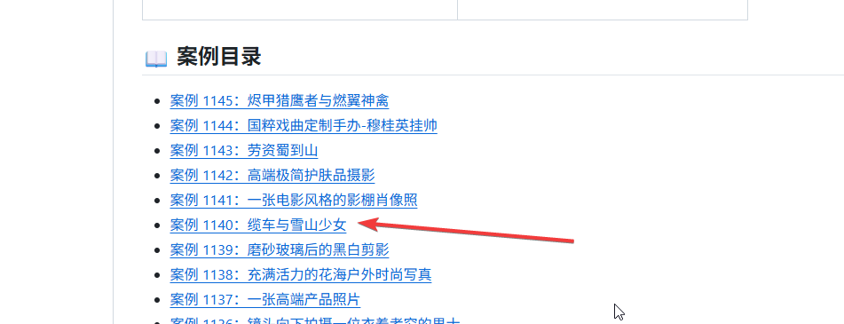
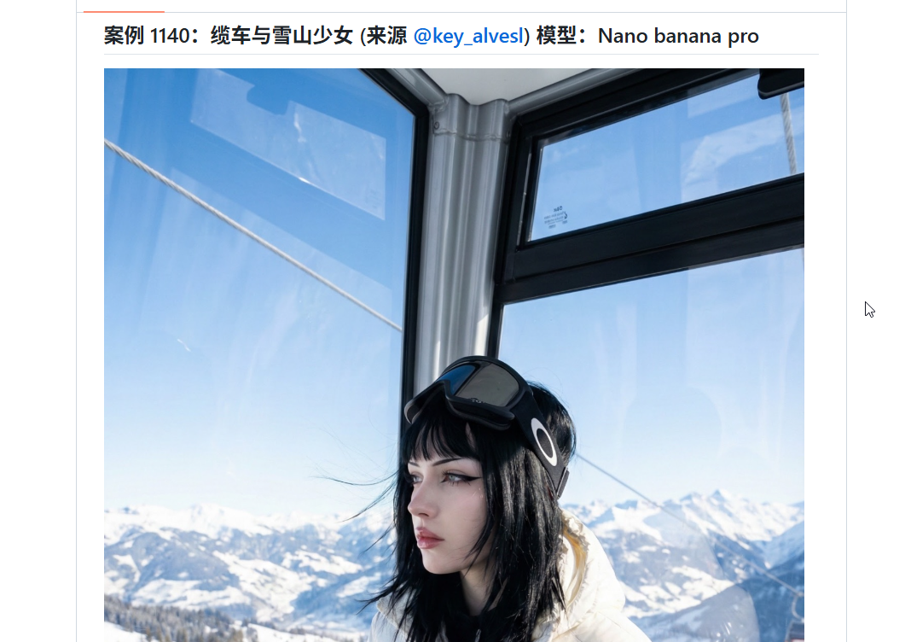
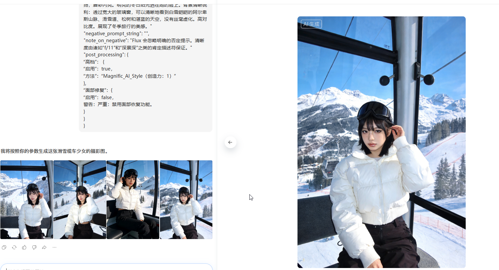

+++
date = '2026-03-24T10:54:01+08:00'
draft = false
title = 'AI 文生图提示词宝库：2.8k star 开源项目，让你的图片更真实'

tags = ['ai工具', '提示词工程', '文生图', '人工智能', '内容创作']
description = '摘要：分享一个 star 达 2.8k 的文生图提示词开源项目 gpt4o-image-prompts，内含大量高质量提示词示例，搭配豆包、Gemini 等 AI 工具，轻松生成真实感十足的图片。'
categories = ['AI相关']
+++

你知道这些真人感十足的图片是如何生成的吗？只需要一个简单的文生图指令，就可以做出一张这样的图片吗？

<div style="display: flex; gap: 15px;">
  
  
</div>

并非如此，好的图片不仅仅依赖模型，提示词也同样重要。

换句话说，好的图片 = 厉害的模型 + 厉害的提示词。

那么如何写出对应的提示词呢？

今天分享一个非常牛的开源项目，star 达到了 2.8k，[开源项目链接](https://github.com/songguoxs/gpt4o-image-prompts)。


大家可以在 git 平台搜索 `gpt4o-image-prompts` ，然后，就可以找到这个项目了。


你可以在项目的 README 上，找到示例图片以及示例提示词。



点击之后，会跳转到对应的案例，案例中会显示图片、提示词、模型、原作者信息，如下所示。

图片：



提示词：

```
{
"meta": {
“项目”:“Ski_Gondola_Egirl_Flux_V4.2”
"target_engine": "Flux.1 [dev] / Nano Banana Pro",
版本：4.2.0（一切尽在掌控 - f/11）
"created_at": "2025-12-18T15:35:00Z"
},
"engine_configuration": {
“模型”： {
"base": "flux1-dev.safetensors",
“量化”： “fp8 / nf4”，
"vae": "ae.safetensors"
},
"lora_slots": [
{
"name": "Realism_LoRA_v2（可选）",
“强度”：0.5，
“注意”：“增强瓷白的肤色、尼龙的质感和雪的反射效果。”
}
],
“采样”：{
"sampler_name": "欧拉，
"调度器": "简单",
“步骤”：28，
"guidance_scale": 2.5,
"shift": 1.0
},
“方面”： {
宽度：1024，
“高度”：1536，
"aspect_ratio": "2:3",
"megapixel_class": "1.5MP"
}
},
"prompt_construction": {
"narrative_layer": {
"风格": "冬季生活方式/旅行摄影",
“拍摄说明”：“在滑雪缆车内拍摄一张清晰、高对比度的照片，使车内主体与车外明亮的雪山景色达到平衡。”
“subject_flow”: “一位肤色苍白、留着黑色狼头短发的年轻女子，身穿白色羽绒服，坐在缆车里，抚摸着自己的头发。”
},
"texture_layer": {
"skin_physics": "苍白的瓷肌，亮泽的嘴唇，夸张的电子女孩眼线，光滑的妆效"
"fabric_physics": "白色羽绒服的亮面尼龙质感，黑色滑雪裤的哑光科技面料，滑雪镜的反光镜片",
"environment_physics": "背景细节清晰：透明玻璃窗、山上的白色积雪纹理、深绿色的松树、蓝色的天空"
},
"camera_physics": {
"lens_imperfections": "高对比度，锐利的日光，玻璃上有轻微反射"
“对焦”：“景深大（f/11）——无模糊。女子、缆车内部以及远处的雪山都清晰锐利。”
设置：索尼 A7R V，35mm 镜头，1/1000 秒，ISO 100（明亮的雪天）
},
"color_grading": {
“white_balance”: “冷色调日光（蓝天/白雪为主）”
“阴影”：“小屋内深邃而清晰的阴影”，
“亮点”：“雪地和外套上的明亮、清晰的高光”
}
},
"final_prompt_string": "一张使用索尼A7R V 35mm f/11镜头拍摄的真实生活照。景深大，画面清晰。一位年轻女性（19-25岁），拥有白皙的肌肤，留着齐肩黑发，刘海齐肩（狼刘海），坐在滑雪缆车内。她身穿亮白色短款羽绒服、黑色滑雪裤，头戴黑色滑雪镜。她轻轻拨了拨耳后的头发，神情平静地看向镜头。妆容精致，带有猫女风格，眼线上扬，唇彩闪亮。明亮的冬日阳光洒在她的脸上。背景清晰锐利：透过宽大的玻璃窗，可以清晰地看到白雪皑皑的阿尔卑斯山脉、滑雪道、松树和湛蓝的天空，没有丝毫虚化。高对比度。展现了冬季旅行的美感。"
"negative_prompt_string": "",
"note_on_negative": "Flux 会忽略明确的否定提示。清晰度由诸如“f/11”和“深景深”之类的肯定描述符保证。"
"post_processing": {
“高档”： {
“启用”：true，
“方法”：“Magnific_AI_Style（创造力：1）”
},
“面部修复”：{
“启用”：false，
警告：严重：禁用面部恢复功能。
}
}
}
```

你可以把上面的提示词 copy 下来，丢到豆包、gemini banana 等 ai 工具中去使用。

下面这个图，就是豆包 ai 生成的图片。怎么样？感觉还不错吧。



另外，这个开源项目，还提供了一个网站，上面有网友们的作品以及提示词。


总的来说，ai 提示词在文生图领域非常之重要，提示词描述的细节越多，生成的图片就越精细。

如果你对文生图提示词的用法还不熟悉，那么你可以仿照案例中的用法，稍作改造一下，就可以生成自己喜欢的图片，从而避免侵权的困扰。


