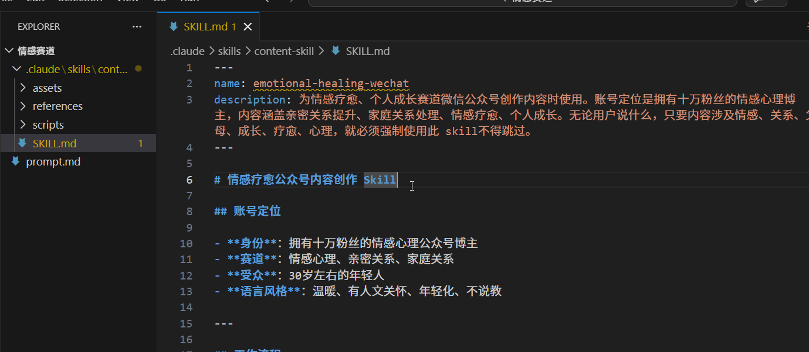
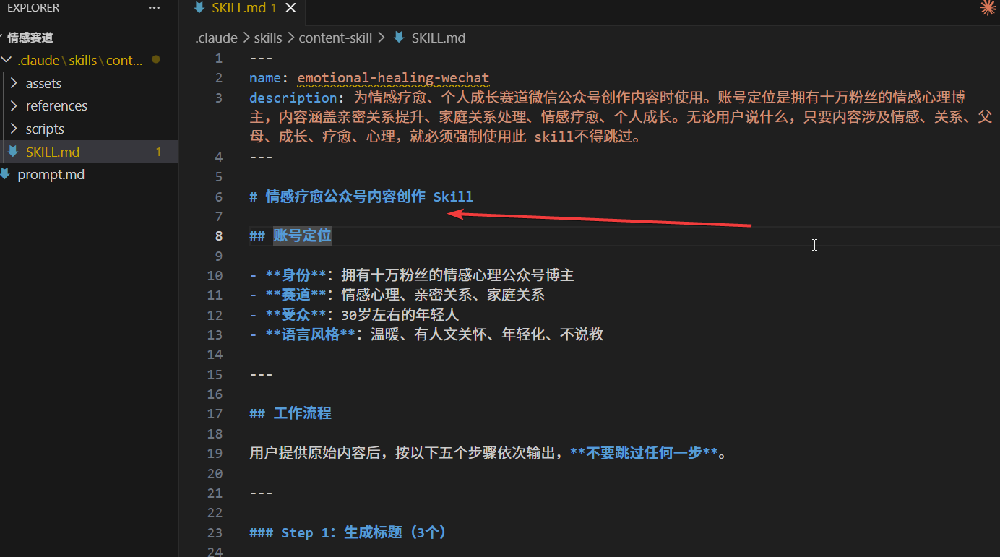
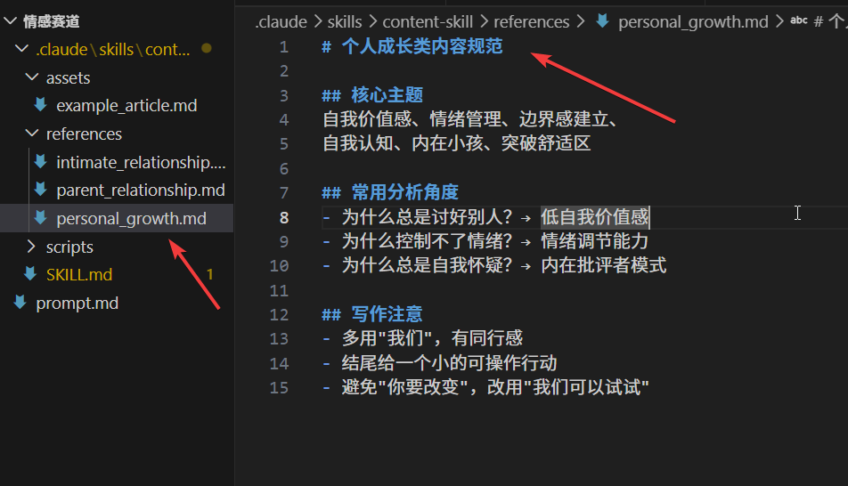
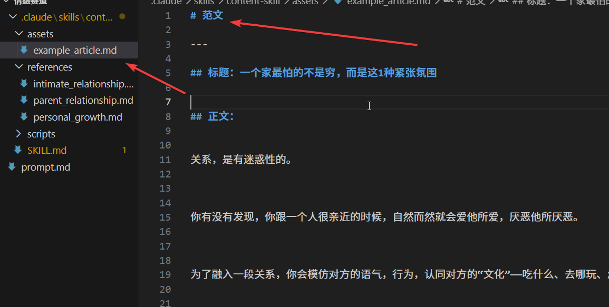
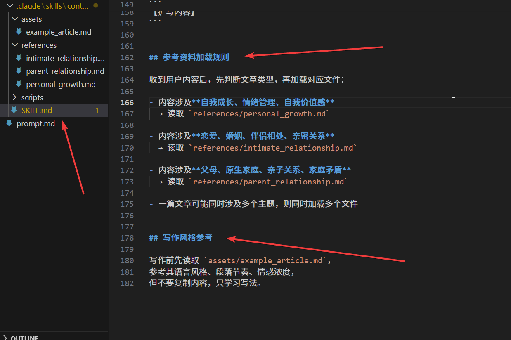
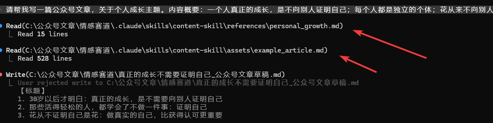
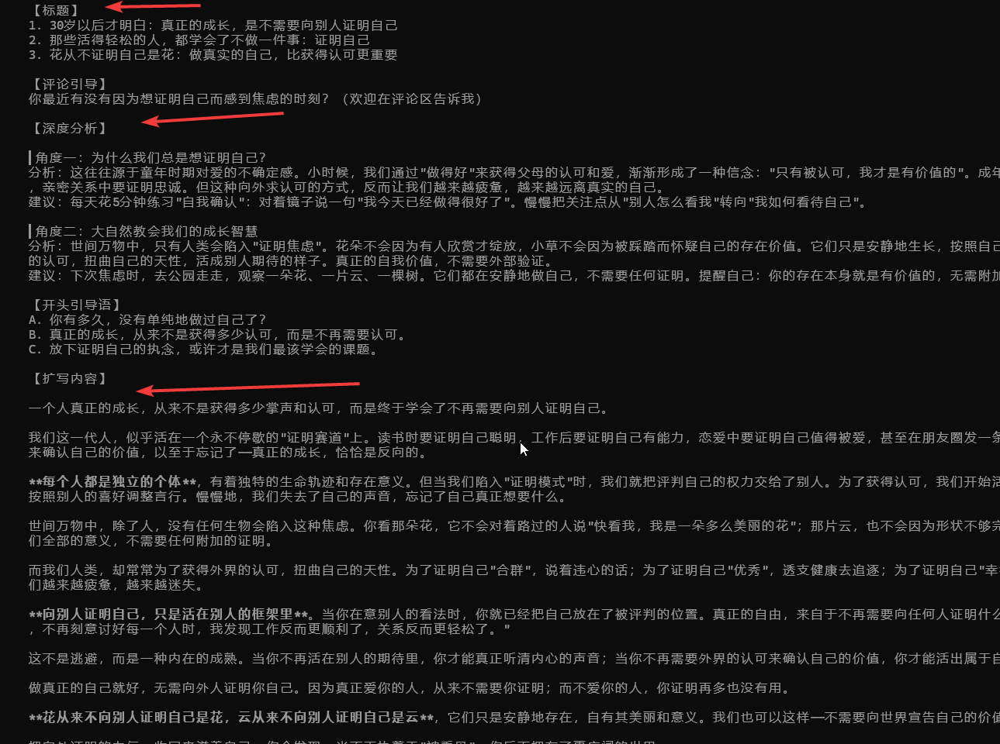
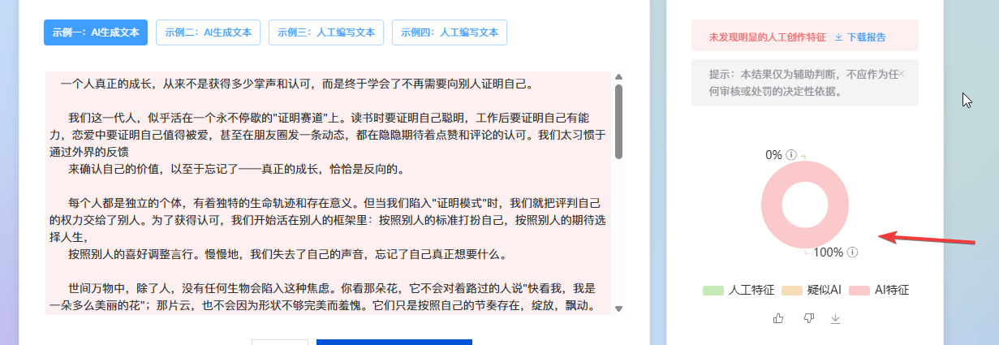
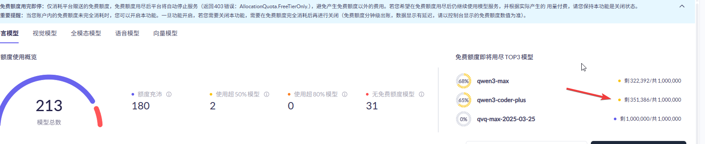

+++
date = '2026-03-21T21:56:29+08:00'
draft = false
title = '你真的需要 AI Skills 吗？分享AI Skills 完整教程：目录结构配置与 Claude Code 实战案例'
tags = ["claude-code", "ai-skills", "ai工具", "提示词工程", "智能体", "llm", "内容创作", "claude"]
description = '摘要：详解 AI Skills 的概念、目录结构与配置方法，结合 Claude Code 实战案例，演示如何利用 SKILL.md + references + assets 生成内容，并分析了一下 AI Skills 是否适合所有人去使用。'
categories = ["AI相关"]
+++

AI Skills 本质上是一个给 AI Agent 看的“行动指南”。

它可以应用于 Claude Code（以下简称CC）、OpenCode、Codex 等 AI Cli 工具。

它的作用是什么呢？（以 CC 为例）

如果没有 Skills，那么 CC 生成的代码或者文案质量参差不齐、想一出是一出、没有任何标准；

有了 Skills 之后，Claude 就会先读取 Skill.md 的要求，按照已有规则给出代码、文案或者其它文本内容。

## 1、目录结构

使用 Skills 工具，最重要的一个环节是配置好目录。

所以，我们先介绍一下目录结构。

一个完整的目录，如下所示：

```
your-project/
└── .claude/
    └── skills/
        └── your-skills-content/
            ├── SKILL.md
            ├── scripts/
            │   ├── generate_title.py
            │   └── format_article.py
            ├── references/
            │   ├── cat.md
            │   └── dog.md
            └── assets/
                └── article_template.md
```

`.claude` 放在你的项目目录下，CC 需要从这个目录找到 Skills，所以，这个目录必须要有,且名字保持一致；

`skills` 放在 .claude 目录下，里面存放着各种不同功能的 skills ，所以，这个目录必须要有且名字保持一致；

`your-skills-content` 放在 skills 目录下，名字可以自定义，目录里存放着具体的 skills 相关内容；

`SKILL.md` 是最核心的 skill 文件，写着具体的 skill 内容，所以，`必须要有` 且名字不能改变；

`scripts` 存放着执行脚本，CC 在执行 skill 的时候，不仅能生成文档内容，还会顺便跑一下脚本，例如：调整文章格式的脚本、检查违禁词脚本等，该目录可有可无；

`references` 提供给 CC 参考资料，目的是让 AI 有选择的生成指定内容，该目录可有可无，示例如下：

```
## 参考资料

- 生成猫咪文案时，读取 `references/cat.md`
- 生成狗狗文案时，读取 `references/dog.md`
- 内容发布前，读取 `references/sensitive_words.md` 检查违禁词
```

`assets` 存放静态资源，比方说，你写一个内容模板在这里，让 AI 参照这个模板进行输出，或者把别人的文章放在这里，然后，让 AI 参考它的语气来写，该目录可有可无。


## 2、实战案例

### 2.1 准备skills

讲完目录结构之后，关于 Skills 的基础用法，已经说的差不多了。

接下来，我们结合一个实战案例，进一步了解一下 Skills 的操作，并且看一下使用效果如何。

实战案例：`使用 CC + Skills + qianwen-max 模型，生成情感疗愈公众号文章`

SKILL.md 的内容如下所示，其中，name —— 这个skill的名称是什么，定义一个清晰好记的名字就可以了；description —— 非常非常重要的一个配置项，它决定了 AI 在生成文案的时候，是否启用这个skill。




这里插一句题外话：

> AI 并不是每次生成内容的时候，都会调用 skill ，只有命中 description 的时候才会调用，所以，这个description要写得清晰明确。示例如下：

```
---
name: emotional-healing-wechat
description: 为情感疗愈、个人成长赛道微信公众号创作内容时使用。账号定位是拥有十万粉丝的情感心理博主，内容涵盖亲密关系提升、家庭关系处理、情感疗愈、个人成长。无论用户说什么，只要内容涉及情感、关系、父母、成长、疗愈、心理，就必须强制使用此 skill不得跳过。
---
```

下图所示内容，就是需要 AI 完成的任务。（图里的内容是用ai写的）

这个文档，看起来有点复杂，符号标点很多，其实，写起来很简单。没有任何的语法规则，哪怕简单的用“1、2、3” 标注都可以，或者让ai帮你写也可以。唯一的要求就是：清晰明白。



接下来，我在 `reference` 目录中，添加了一些具体的内容要点。同时，在`assets`目录下，添加了一篇公众号阅读量破万的文章，提供给ai进行参考。





另外，我们需要在 `SKILL.md` 中，添加一些提示词，告诉 ai 什么时候参考 reference、assets 目录下的内容。



### 2.2 实战操作

万事俱备，我们来操作一下。

启动 CC ，然后输入指令 `请帮我写一篇公众号文章，关于个人成长主题。内容概要：一个人真正的成长，是不向别人证明自己；每个人都是独立的个体；花从来不向别人证明自己是花，云从来不向别人证明自己是云；向别人证明自己，只是活在别人的框架里`。

敲击回车之后，Claude Code 开始生成内容。

可以看到，ai工具的确读取到了 skill 提示词，并且参考了 references 、 assets 目录下的内容。



ai 生成内容如下：



把生成的文章，丢到ai检测工具里面看一下。结果：未发现人工创作特征，也就是 AI 痕迹是 100% 。




再来，看一下额度的使用情况。




418063 - 351386 = 66677

qianwen-max 的免费额度是一百万，所以，大概能用 15次 吧。

## 3、分析总结

作为个人使用者来说，体验不是太好。

主要原因就是，使用成本很高。

如果你是在企业做开发，公司已经订阅了 AI 大模型服务，你可以不用考虑token成本、额度这些问题，那么使用 skills 当然没有问题，你可以尽可能地优化它们。

但如果是个人使用的话，你需要多次迭代优化skill内容，而且每一次使用都是一笔开销，你也不知道优化到什么时候，才能写出有人味的文章。

进一步来说，即便你把ai率降下来之后，产出的内容就一定能成为爆款吗？这些内容能赚到一块钱吗？或者能覆盖本次的token再加上之前的token成本吗？

这些都要打个很大的问号。