+++
date = '2026-03-16T14:50:57+08:00'
draft = false
title = '两个免费静态网页托管平台：GitHub Pages 与 Cloudflare Pages 使用教程'
description = '摘要：介绍 GitHub Pages 和 Cloudflare Pages 两个免费的静态网页托管平台，手把手教你如何发布个人简历、博客或个人网站，零费用轻松上线。'
tags = ['GitHub', 'CloudFlare', '建站', '建站教程', '个人博客', '静态网站', '免费托管']
+++

本文通过实战案例，跟大家分享两个免费托管静态页面的平台。

简单来说，你可以在这些平台上免费发布你的个人简历、个人网站、博客等内容，超级方便。

## 1、Github

Github 配置静态页面的步骤最为简单。

### 1.1 创建一个仓库

点击 new ，填写完配置信息后，即可创建一个个人仓库。

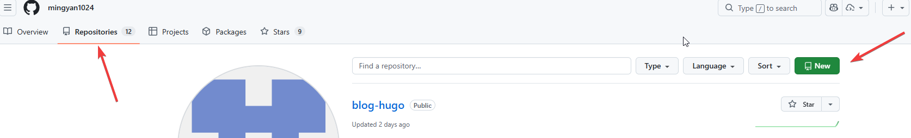

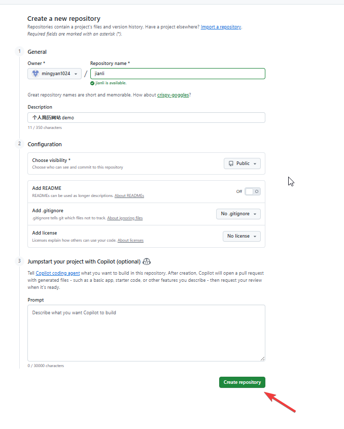

### 1.2 提交代码

将你的静态网页代码提交上去，一定一定要注意：`必须要有 index.html`。另外，这个项目的访问权限一定要配置成`public`（默认的）。

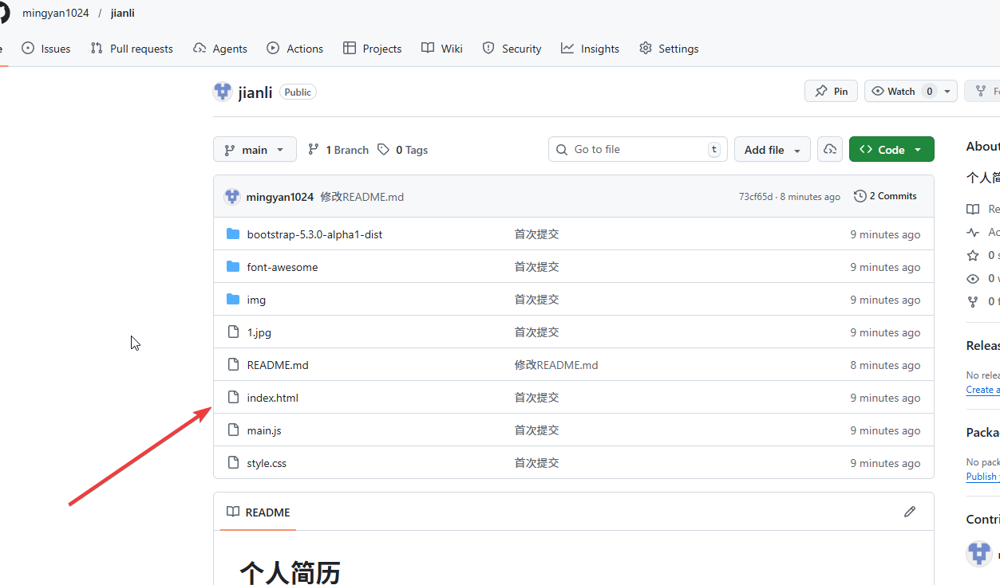

简单解释一下：`index.html` 相当于一个入口。不然的话，平台不知道从哪个页面开始解析。

我这里已经写好并开源了一个简历模板——[个人简历模板](https://github.com/mingyan1024/jianli.git)，有需要的朋友可以参考一下。

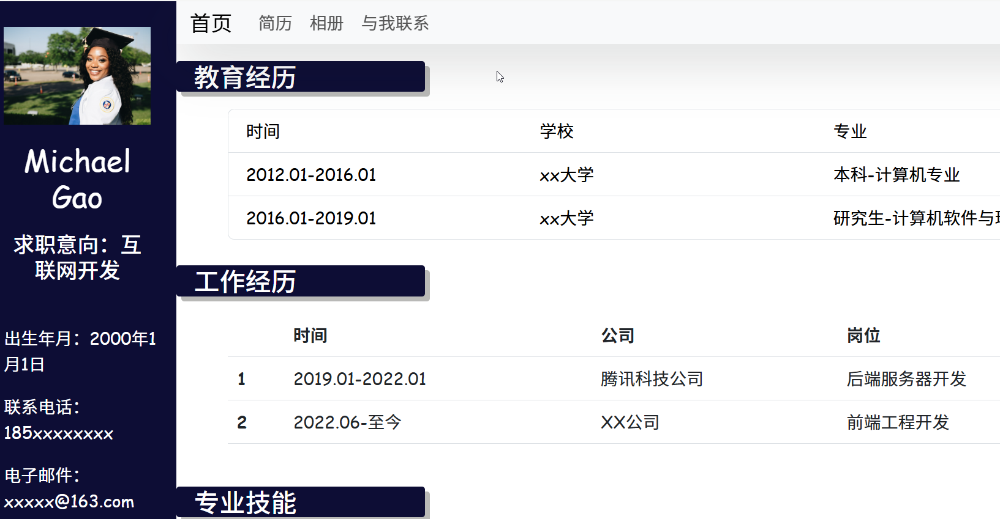

### 1.3 配置页面

在仓库主页面，找到setting，找到page，找到main，选中之后，点击save。

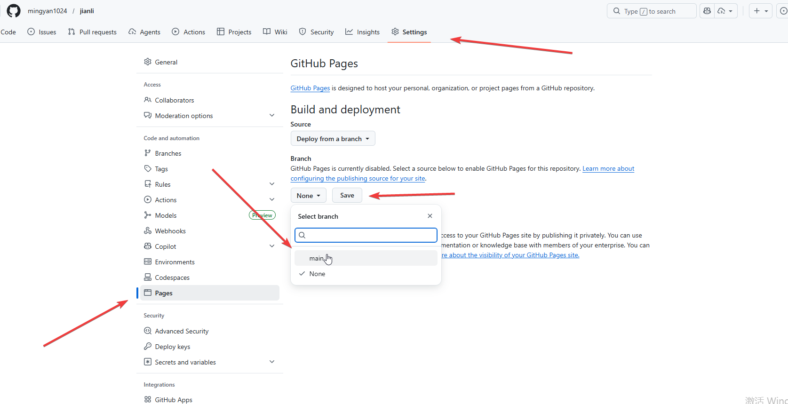

稍作等待，你的网站就上线了！！就这么简单！！！！

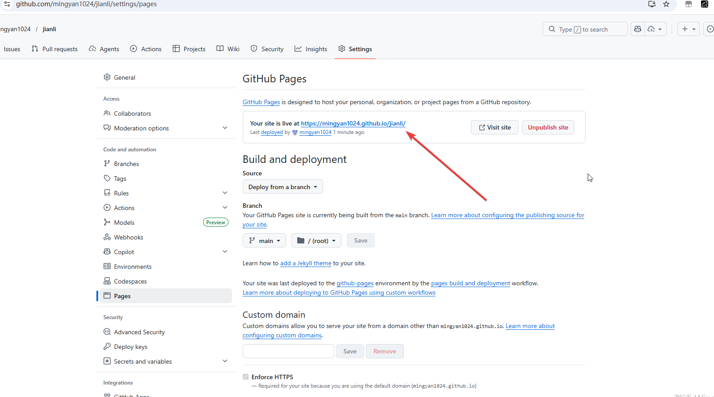

## 2、CloudFlare（以下简称CF）

CF 托管静态页面，有两种方式：

### 方法一：关联git仓库

进入CF平台的账户界面，在 workers and pages 这里，创建一个应用。

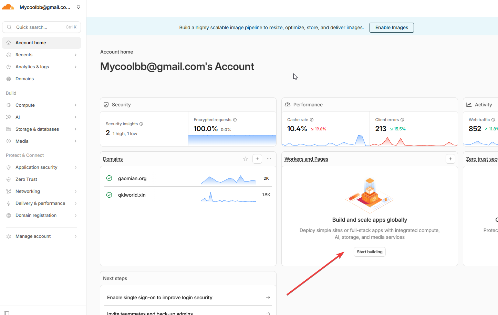

点击 GitHub 这个选项，连接你的 Git 仓库。

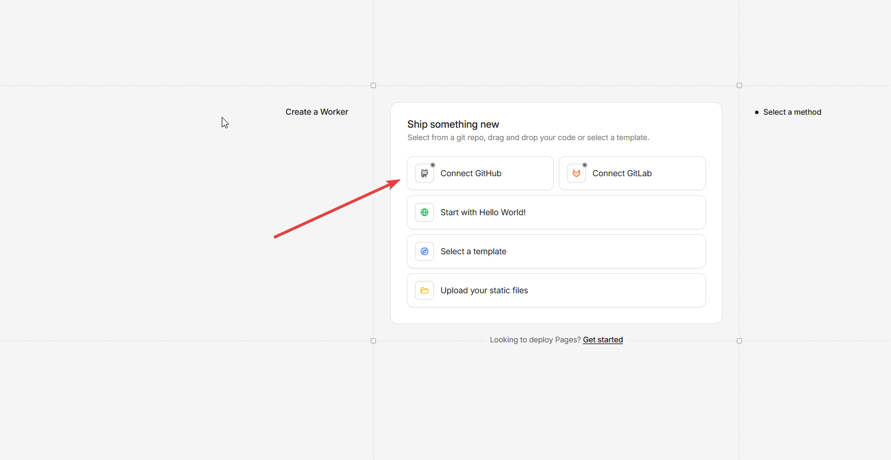

对仓库进行授权。

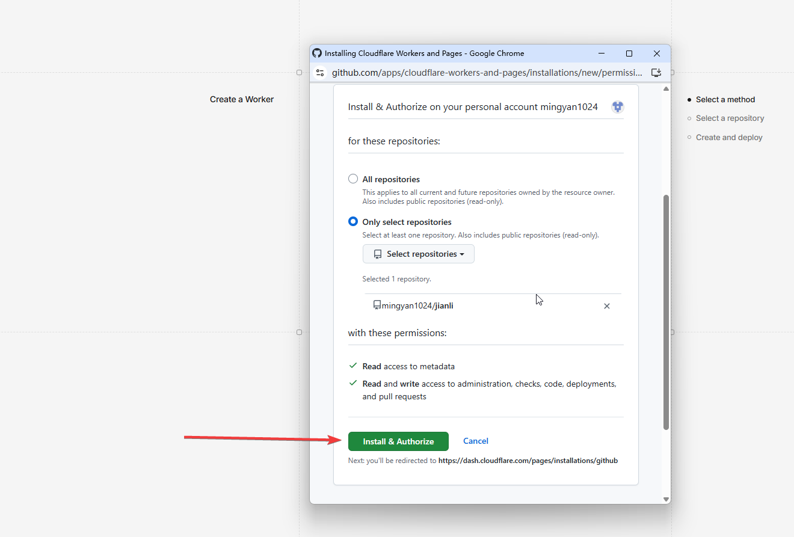

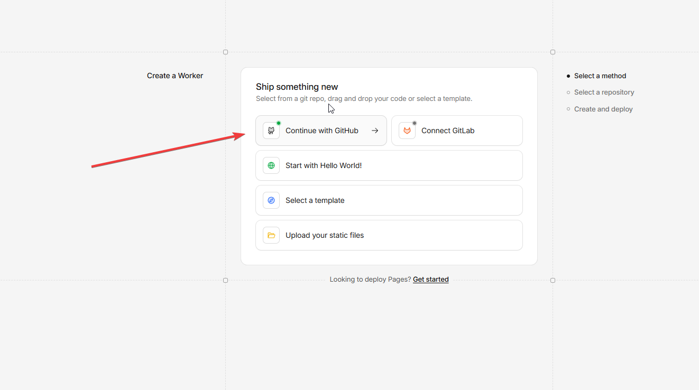

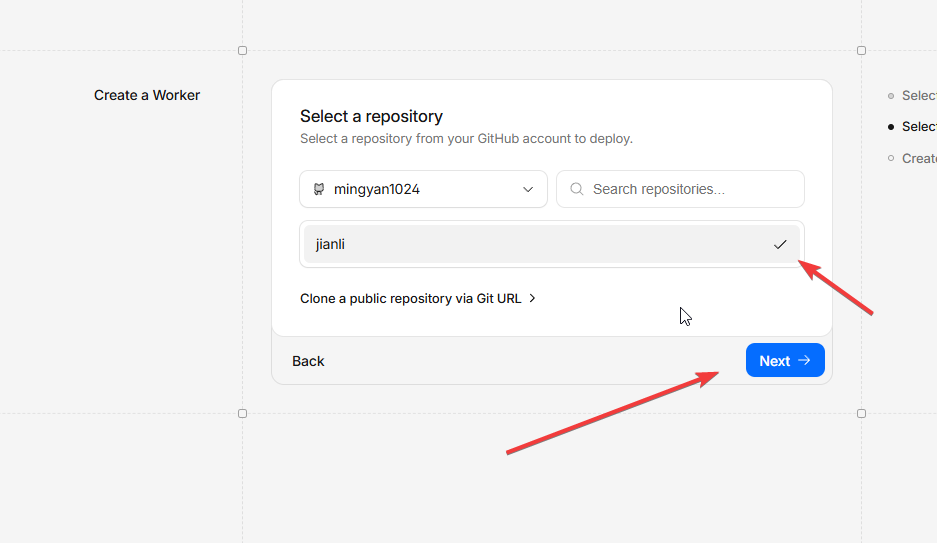

点击 deploy 进行部署，无需填写任何东西。

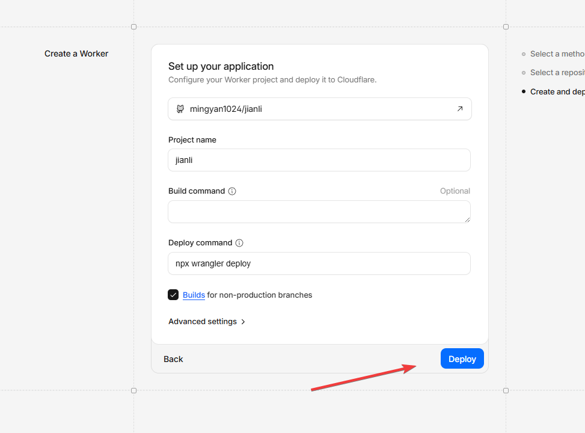

稍作等待，你的个人简历网站，就发布成功了！！！

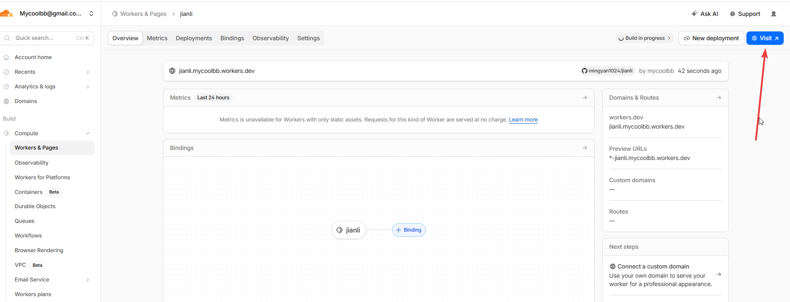

### 方法二：上传静态文件

在这里创建一个新的应用。

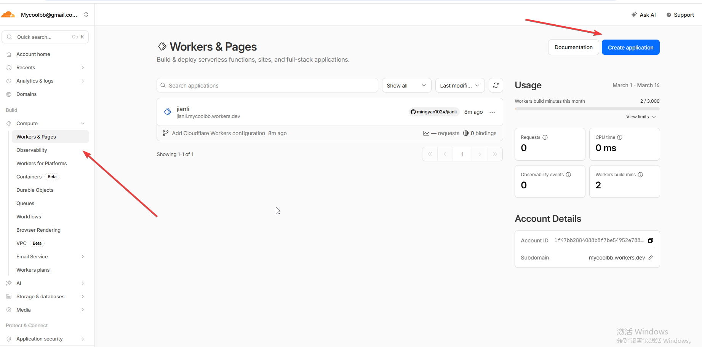

点击这里，选择上传文件。

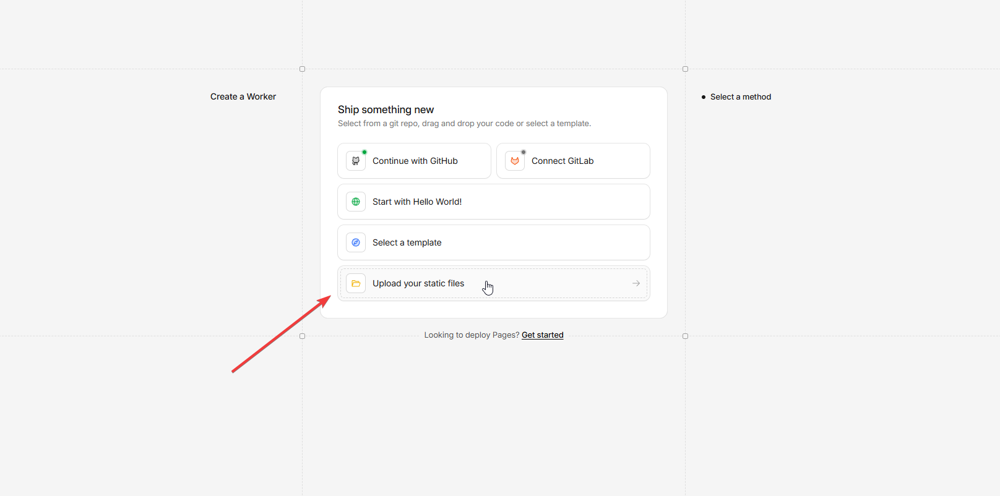

将刚才的简历项目打包，然后，上传至CF平台。请务必上传压缩包。上传文件夹以及其它形式都不太方便。

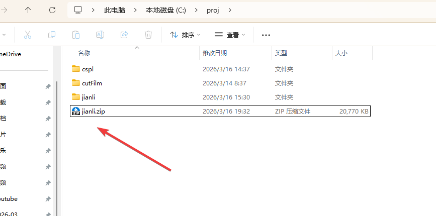

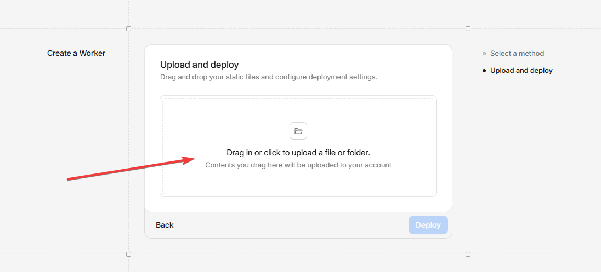

点击deploy，稍等一会，你的简历网站就发布成功了！！！

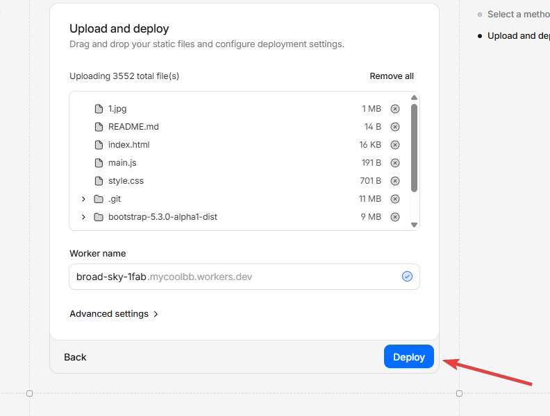

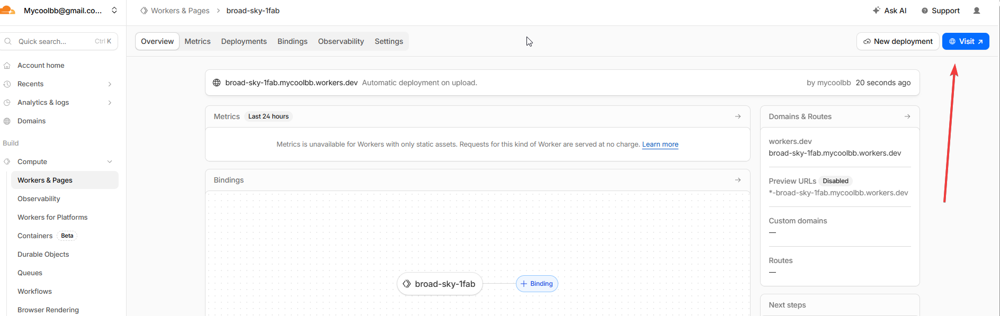

关于 CF 的这两种部署方式，我想说一点，就是我更推荐第一种方式。

因为只要你提交代码到git仓库，它就可以自动更新页面（读者请自行尝试一下）。

而第二种方式很麻烦，需要你手动提交，也就是把网页代码重新打包，再上传到CF上。

以上就是本期分享，感谢阅读。最后想说一点，就是 CloudFlare 有很多免费好玩的用法，后面会继续更新文章探讨这些问题。再次感谢阅读。