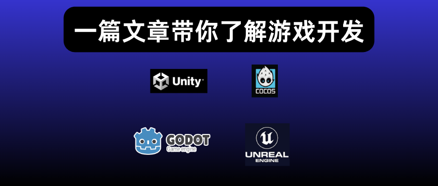

+++
date = '2026-03-31T22:08:15+08:00'
draft = false
title = '游戏开发技术入门：四大主流引擎对比与发布平台全解析'
tags = ['游戏开发', '游戏引擎', 'Unity', 'Unreal', 'Godot', 'Cocos Creator', '独立游戏', '入门教程']
description = '零基础游戏开发入门指南，详细对比 Unity、Unreal、Godot、Cocos Creator 四大主流游戏引擎的优劣势，以及 Steam、itch.io、App Store、微信小程序等主流发布平台费用与流程，帮你找到最适合自己的开发路线。'
categories = ["游戏开发"]
+++

最近突然对游戏开发技术产生了兴趣，于是，写一篇技术文章聊一下这个东西。

本篇文章是游戏开发的入门篇，仅适合零基础的人阅读。

作为零基础入门者，千万学习复杂的图形工具，例如：OpenGL、Vulkan……

最先了解的应该是游戏引擎。

## 1、游戏引擎

什么是游戏引擎？简单来说，就是帮你造游戏的工具集合。

打造完成，便会出现一个可执行的游戏程序。

你负责：写逻辑，引擎负责：物理计算、屏幕渲染、音频播放……

总之，你本人负责游戏的设计和编写环节，它负责按照你的想法用计算机语言构造出来。

目前市面上主流的游戏引擎有：Unity、Unreal、Godot、Cocos，后面我们会一一梳理这几个游戏引擎。

## 2、游戏发布

游戏做完之后，需要发布到平台上。目前，主流的平台有如下几个：

### 2.1 itch.io

该平台发布游戏最为简单：审核宽松，填写对应的项目、标题、描述，上传游戏文件，设置价格……

然后，就可以发布了。

无需其它成本和费用。

该平台与开发者的默认分钱比例为91分成，但开发者也可以自行决定分成比例。

如果开发者想全拿，也是可以的。

### 2.2 steam

这个平台发布成本相对较高，除了填写必要的发布信息之外，还需要支付100美元的开发者费用，而且是每发布一个游戏都需要支付一次。

请注意：如果你的收益达到了1000美元之后，它会退还给你这部分钱。

有点押金的意思。

该平台与开发者是37分成，开发者拿7。

### 2.3 app store

该平台的发布流程非常复杂，需要填写详细的发布信息，并等待审核（有可能被拒）。

另外，开发者账号每年99美元。

这笔成本也是挺大的。

### 2.4 微信小程序

个人开发者，发布一个微信小游戏，无需收费。

该平台审核较为严格，而且可能需要其它的额外材料，例如：软著？

另外，如果游戏调用后台接口的花，那么需要对接口的域名进行备案。

### 2.5 邪修法

还有一种比较邪修的方式，就是部署在自己的服务器上。

这种方式适合网页游戏。

不借助任何平台，自己开发、自己推广。

## 3、游戏引擎对比

下面对游戏引擎，进行一些入门级的介绍：

### 3.1 Unity

优势：

1、Unity 这个游戏引擎较为全面，什么游戏都能做，最擅长中小型游戏、手游；

2、它可以一键导出 ios/android 游戏包；

3、非常主流的一个引擎，市面上有很多手游都是unity做的，社区资源丰富，想要啥都有；

4、pc端 2D、3D 游戏开发完全没有问题，steam上有很多独立游戏也都是用 unity 做的；

5、在VR、AR领域，Unity引擎的表现很强；

6、Unity引擎对于小级别的开发者，不收任何费用。小级别开发者指的是：过去12个月收入少于20万美元。如果超过这个门槛就要收钱了。所以，大家尽量不要赚那么多钱哈（狗头）；

劣势：

1、不太适合超大型 3A 游戏，因为有个引擎更适合 3A 游戏，它就是 Unreal；

2、开发语言有一定的学习成本，需要掌握C#；

总的来说，该引擎综合实力不错，适合有一定开发经验或者编程经验的人，并不适合入门。

### 3.2 Unreal

优势：

1、Unreal 引擎名气很大，有大厂游戏厂商背书。例如：黑神话悟空，堡垒之夜，都是用它开发的；

2、该引擎下载和使用是免费的，如果你通过它制作的游戏，上线后收入超过了100万美元。它会抽取 5% 的版税；

3、画质顶级，业界公认；

劣势：

1、这个引擎学习难度很大，需要了解C++编程语言；

2、编译时间较长，你修改一次代码，需要等老半天；

3、它还很吃电脑配置，因为这个引擎做的游戏画质很好；

4、该引擎的游戏主要面向PC市场，手游领域用得很少；

总的来说，这个引擎性价比不高，适合大厂开发，不适合新手或者独立开发者。

### 3.3 Godot

优势：

1、学习成本低，不需要花任何费用，代码开源；

2、编程语言需要了解：GDScript，一看就知道这是一个脚本语言，所以，它简单易上手；

3、对于 2D 游戏，它的各种支持做得都很好；

劣势：

1、相对于其它主流引擎（Unity）来说，比较小众，社区虽然在蓬勃发展，但资源还是没有那么多；

2、对于 3D 游戏的支持程度，没有其它引擎做得那么好；

总的来说，它的性价比不错，是新手入门的首选。

### 3.4 Cocos Creator

优势：

1、国产游戏引擎，中文友好；

2、免费开源无抽成；

3、适合微信小游戏、休闲手游、2D游戏、H5网页游戏，代表作：开心消消乐、捕鱼达人，在这个赛道，它受众很广；

劣势：

1、3D能力偏弱，跟其它主流引擎相比差距明显；

2、社区圈子较小，国际影响力小，在海外存在感较低，主要是国内开发者在做贡献，所以，插件资源少很多；

3、有一定的学习成本，需要了解TypeScript编程语言；

总的来说，这个引擎也可以作为入门的选择。如果你是前端开发者，或者了解typescript编程语言，那么这个引擎对于你来说，上手就更快了。

## 4、题外话：游戏mod

除了游戏开发本身这个赛道之外，还有一个偏僻的小道就是 —— 游戏 mod 开发。

mod 全称是 modification，简单来说，就是对游戏的二次创作。

比方说，换人物皮肤、换地图、修改玩法……

最为成功的两个案例：

一个是cs。

cs并非完完全全的独立游戏，它是在 Half-life（半条命）游戏的基础上进行的二次创作。一经问世，风靡全球。

另一个是dota。

dota 是魔兽争霸的衍生品，它的影响力就不必说了。

需要强调一点，mod 开发需要官方的支持。

官方提供了mod工具，玩家或者游戏创作者便可以进行“二创”。

如果官方没有提供mod的口子，而别有用心之人使用其它技术进行二次修改，那就是严重的违规行为。

以上就是本篇文章的分享，感谢阅读。

