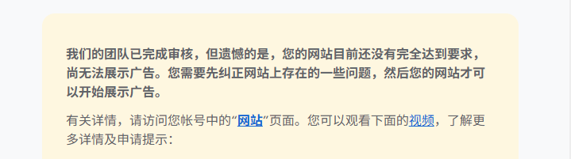
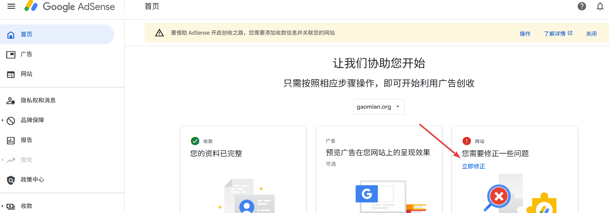
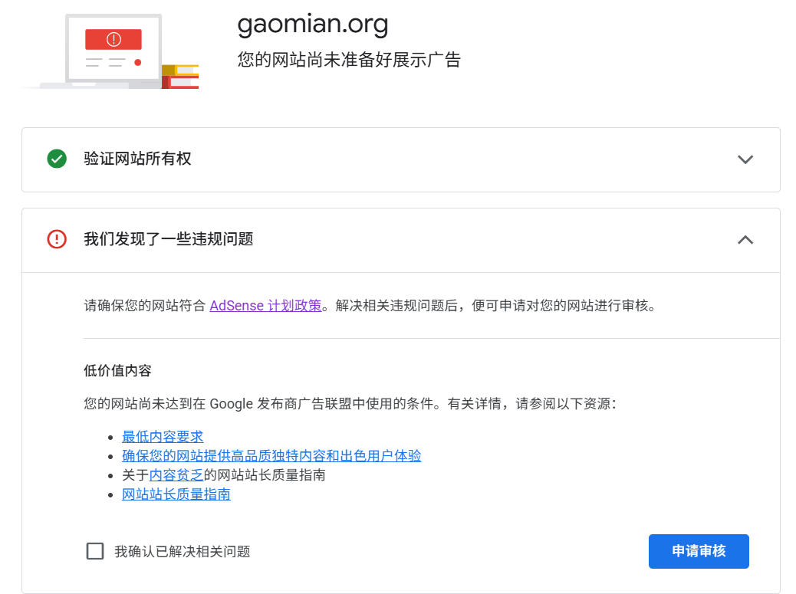
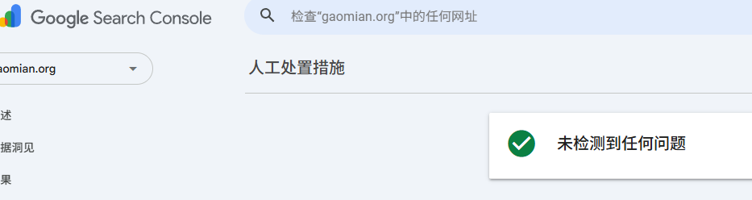

+++
date = '2026-04-08T22:19:06+08:00'
draft = false
title = '第一次提交Google AdSense审核后被拒？低价值内容问题该如何解决'
tags = ['Google AdSense', 'SEO', '博客', 'web建站', '网站优化', '广告联盟', '内容创作', '建站教程']
description = '分享Google AdSense首次审核被拒经历，详细分析"低价值内容"问题原因，提供系统的整改策略（隐私政策、关于页面、流量优化等），介绍Media.net、Ezoic等替代广告联盟，以及低成本运营博客的实用方案。'
categories = ['web建站']
+++

果不其然，我的博客网站，在第一次提交的时候，没有被 google adsense 收录。

见怪不怪了，听过很多小伙伴的网站在提交 google adsense 的时候，都不太顺利。

前两天，在小红书上看到了一个博主的分享，她说，她的网站提交了两年才被 google 收录。

只能说，任重道远吧。

成功不成功，都当做一次体验吧，持续优化就好了。

我的提交审核的时间是3月30日，拿到结果是4月8日，蛮快的，至少比我想象中要快。

谷歌的邮件中并没有具体告诉我问题出在哪里，仅提示我需要纠正网站上存在的问题。

我点击进入 google adsense 官方页面，上面有个提示显示低价值内容。

（首页这里点击进去，就可以看到审核失败的信息提示）

## 1、面对的问题

我按照上面这个“参阅以下资源”点了进去：

1、最低内容要求

这个链接里的内容，没有看到任何有价值的信息，这里显示的都是很笼统、很众所周知的东西，我觉得任何正常人做网站都不会踩这个雷区。

我自认为，这一条应该是满足的。

2、确保您的网站……

这个链接里的内容，相对来说丰富那么一点点，另外，有两个视频，指导读者查看具体的优化建议。

这里，主要说的是，要保证内容是原创的、不要抄袭、不要过度地引用别人的东西、要有导航、导航要清晰……

但说实话，并没有特别多的干货。这些建议大多用的都是形容词进行描述，例如，要将导航做得清晰。

我想知道，什么是清晰？什么是不清晰？这里都没有提到。

而且，我的博客网站是有导航的。

3、关于内容贫乏……

这一部分内容会稍微有那么一点价值，至少它提供了一个页面，告诉你是否存在人工审核问题。

（我的网站没有人工审核问题，但依然没有接入 google adsense）

这个页面指出了一堆改进方法，可以说是浩如烟海，如果逐条研究的话，时间成本还是挺多的。

说来说去，google 还是希望有价值的、原创的内容呈现在页面上，但什么是有价值的，这个网页依然没有给出一个明确的指标。

（我的博客文章都是自己手写的原创文章）

也许 google 怕说的太明白，大家就有漏洞可以钻了吧。

4、网站站长质量指南

点进去之后，并没有看到有用的指南信息。依然是车轱辘话，反复说 —— 不要制作垃圾内容，不要重复使用关键词……

面对如此空洞（它自己就很空洞）的“指南”，我们应该做什么呢？

## 2、应对策略

### 2.1 整改并再次提审

整改肯定是要做的，肯定不能放弃，对吧。最多只是花点时间成本而已，又不要钱，而且对自己也是一种成长和提高。

搜了一些干货，可以从下面几个角度整改：

- About / 关于 页面（介绍博主是谁）
- Privacy Policy / 隐私政策 页面（必须有）
- Contact / 联系方式 页面
- Disclaimer / 免责声明（技术博客尤其需要） 
- 继续保持更新
- 接入网站数据分析工具（Google Analytics、Google Search Console、Cloudflare Analytics），查看网站浏览情况
- 学习别人的网站，参考一下网站的排版、布局以及自己网站没有的元素

另外，我在网上查到了一些有价值的信息，例如：流量为王，网站要有人看，谷歌可以看到你的网站浏览数据是怎样的。

还有一点需要注意，google adsense 的审核提交次数理论上是没有上限的，但是，不能频繁提交，这会被判定为恶意提交，至少有一段时间（几周）的修改之后，再考虑提交。

### 2.2 接入其它广告

在网站调整和审核阶段，我们可以同步申请其它广告联盟的广告。

例如：

- Media.net

Yahoo/Bing 广告网络，质量高；技术类内容收益不错；要求英文内容为主，中文站通过率低

- Ezoic

对流量要求低，小站也能申请；用 AI 自动优化广告位置，收益比 AdSense 高；支持中文站

- Adsterra

审核很宽松，基本秒过；适合流量积累期使用；广告质量参差不齐，注意选广告格式

- PropellerAds

同样审核宽松；Push 通知广告是特色；适合过渡期

### 2.3 低成本运营方式

做网站需要花钱，服务器+域名的费用虽然不高，但也是一笔费用。

假如迟迟没有成功接入广告，那就需要考虑低成本的运营方案。

首先，域名这笔费用是少不了的，接入 google adsense 必须要有个域名。大概 60-80 元/年（各个平台价格策略不同，这是一个平均价格）。

服务器端，可以采用 vercel、github、netlify 这些平台进行部署，免费的。特别适合博客这样的静态页面。

这些平台会提供域名，但是，这些域名不能用来申请 google adsense 。

所以，你需要将你的域名解析到这些平台部署的服务。

这样成本不就降低了吗？你只需要支付域名的费用就可以了。等你的网站做起来、有流量之后，你再考虑租用服务器，并把你的服务部署过去。

这其实是个不错的策略。

另外，强调一点 —— vercel平台的免费政策里提到，不允许接入商业广告，也就是不能接入google adsense，除非你花钱升级为高级会员。

但是，很多人都会这么做，在免费项目里挂google广告。

本文也不推荐大家这么去做，所以，你自己把握一下吧。

---

文章的最后，我想说：

经过了一番调研、看了一些网友的讨论之后，我发现，如果你做的是一个正常的、不搞灰黑产的、不碰红线的、不搞投机猫腻的网站。

想要接入广告的话，唯一一条建议 —— 流量为王，想尽办法搞流量，有人看，才能被 google adsense 收录。

感谢阅读文章，下期再见。

