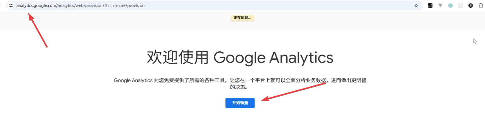
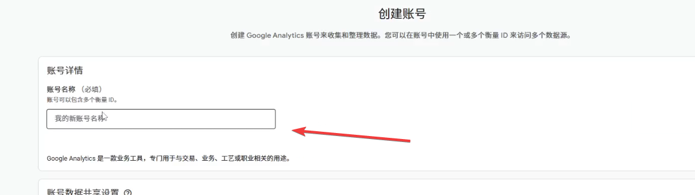
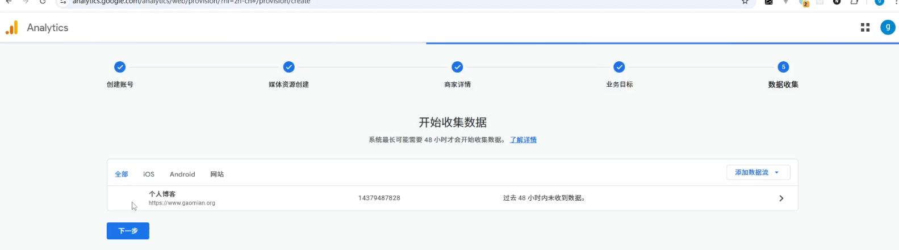
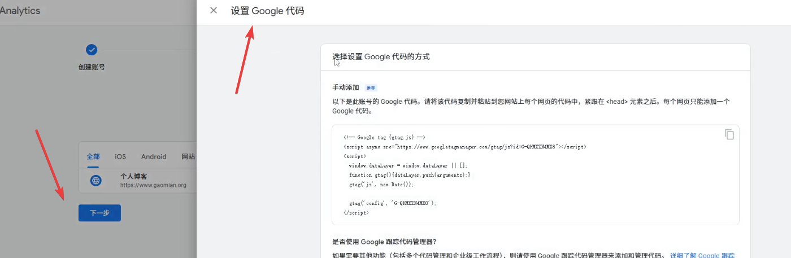
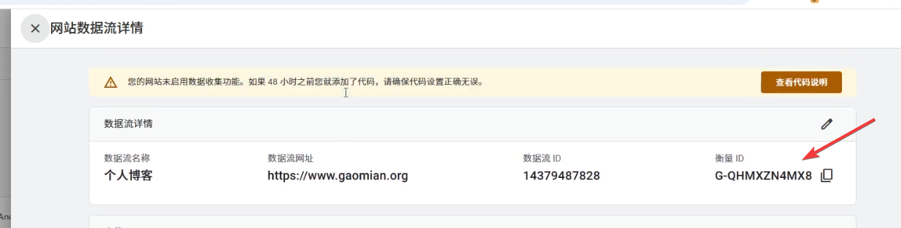
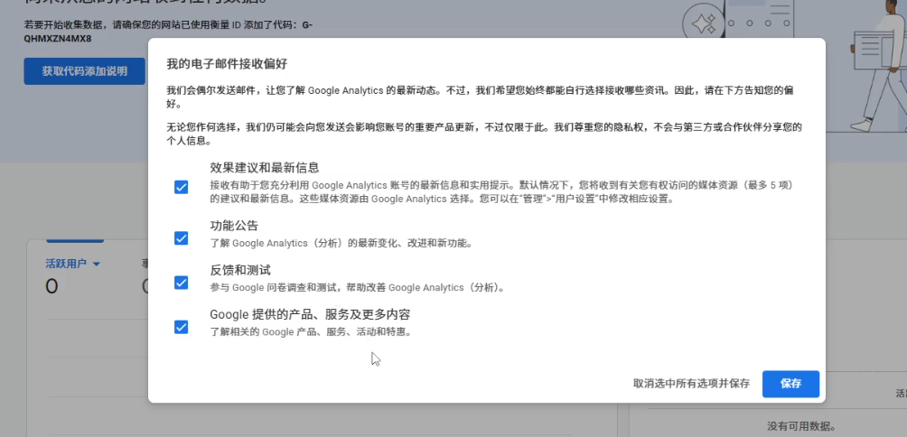

+++
date = '2026-04-25T14:32:30+08:00'
draft = false
title = 'Google Analytics 教程：免费监控网站流量与用户数据'
tags = ['google-analytics', '网站分析', '网站流量', 'hugo', '谷歌分析', '数据统计']
description = '手把手教你免费接入 Google Analytics 谷歌分析平台，掌握网站访问量、用户来源、热门内容等关键数据，助力个人网站和博客精准运营。含 Hugo 配置详细步骤。'
categories = ['web运营']
+++

拥有网站的朋友，不管是个人网站、团队网站还是公司网站，都希望能够看到网站的数据。

例如，访问量如何、浏览量如何，以及网站的用户来自哪些地区，喜欢什么内容等等。

这些数据可以进一步帮助我们优化网站的内容，制作出更加符合用户习惯的网站。

用户看得多了，流量就多了，流量多了，你不就可以接入谷歌广告，赚钱了吗？

（建议大家看一下我的这两期视频，我通过实际案例，分析了流量对于接入谷歌广告的重要性）

言归正传。

那么，如何搭建这样的可视化的平台呢？

今天，我推荐给大家一个超级实用的, 超级简单，而且免费的方法，包括我自己现在也在用的一个方法，就是将你的网站接入google analytics。

google analytics，我们暂且叫它谷歌分析平台吧，这样说起来比较顺嘴一些。

如何接入这个平台呢？

第一步，就是进行网站配置。

## 1、网站配置

打开这个谷歌分析的官方网站。

点击开始衡量。



账号名称这里填写一个简单好记的名字就可以了。



媒体资源名称这里，同样填写一个简单好记的名字就可以了。

接下来是时区和币种，这里一定要跟你所在的地区保持一致。

接下来的商家详情这里，按照你的实际情况选择即可。这个网站是自己制作，自己运营的，所以这里我选择的是小型。

接下来的业务目标这里根据你的实际情况和想法，选择即可。

条款这里选择——我接受。不接受也不行哈，不接受，人家就不让用了。

平台这里，我选择的是网站，选择完了之后，将你的网站域名写到这里。

当你看到这个界面，表示你的谷歌分析平台已经配置成功了。



接下来呢，我们需要将谷歌分析功能嵌入到你的网站里，嵌入成功之后，谷歌才能采集到网站的统计数据。

## 2、代码配置

点击这里的下一步，我们可以看到有一个弹窗。

弹窗里给了一个demo，介绍了一下，如何将代码嵌入到你的网站里。

这个方式，我们看看就好，不推荐大家使用，因为现在大家建网站都是用的工具或框架，而这些框架里，集成了更简单的配置方法，所以，不需要像它演示的这么麻烦。




接下来，我们重新点击网站这里，页面会给我们一个弹窗。

我们点击右上角的查看代码说明这里。

又会出现一个新的窗口。窗口这里展示的是网站开发的框架。如果你的网站，用的是其中任意一个框架，例如：shopify。

你就可以点击进去，找到专属的配置方式。

那么我这里开发网站，使用的是 hugo 这个工具，不在列出的这些平台内。

所以，我需要换一种方式，嵌入采集功能的代码。如果你的网站，跟我一样使用的 hugo 工具，那么你就可以参考，我接下来将要展示的步骤。

### 2.1 配置hugo.toml

打开你的网站项目目录，找到 hugo.toml 文件。

将下面这个代码嵌入到你的 hugo.toml 文件中。

```
[services]
  [services.googleAnalytics]
    ID = "G-XXXXXXXXXX"  # 替换成你的衡量 ID
```

嵌入完成之后，将弹窗里的这个ID，填充到xxxxx这里。



OK，只需要做到这一步，就大功告成了！怎么样是不是非常简单。

### 2.2 提交并发布

接下来，就是将 hugo.toml 提交到 git 仓库。因为，我这里配置了 github 的 cicd 工具。所以，只需要提交代码，就可以将网站发布成功了。

（大家可以参考一下我的这篇视频，我分享了一个实战案例，讲解了一下如何接入github的CICD）

OK，当我们再次，回到谷歌分析平台的时候，我们发现，平台界面已经改变了。

恭喜你，接入成功！

## 3、初体验

配置完成之后，再次进入主界面会有这样的提示。

这里的提示是说，如果谷歌分析平台有了更新之后，会给你的邮箱发送相关的提醒。

我这里全部进行了勾选，并点击保存。



进入到主页面之后，我们可以点击获取代码说明这里，可以看到提示信息——嵌入的代码已经配置成功。

再次回到主页这里，可以看到已经有活跃用户数目展示出来。

这里需要说明一下：这段视频的录制时间是4月16日，由于谷歌分析平台，我这里才刚接入，所以，采集到的数据是很少的，暂时无法看到很明显的样本特征。

十天之后……

ok，大家现在看到的视频，是4月26日录制的，已经接入成功十天了。

我们可以看到，谷歌分析平台已经采集到了很多有用的信息。

在过去的这段时间里，活跃用户的数目在不断增长，浏览次数也在增长，这里的事件数也在增长。

跟大家说明一下，事件数目指的是，点击页面，滚动页面，还有点击下一页等等操作，只要用户有这些操作，就会增加这个事件数。

下面这个卡片这里，我们可以看到更加详细的信息。

比方说，用户来自于哪些国家和地区。

还有用户喜欢看的内容有哪些，比方说，网站的用户比较喜欢看，Iphone投屏的这一篇博客，还有如何像刷抖音一样逛Github的这一篇博客。

最后这一栏，展示的是用户是通过何种方式，访问你的网站。

这里Direct表示，用户直接在浏览器输入你的网址访问的。

Organic Video表示，用户是从视频网站过来的。

Unassigned表示，暂时无法识别来源。

Referral表示，用户是从其它网站链接过来的。

进一步点击会话来源，我们可以看到具体的访问渠道，例如，油管和b站。

---

总之，谷歌分析平台的体验还是很不错的，我们可以清晰地看到网站流量来源，为我们网站的运营提供数据支持。

另外，这个功能的接入也是十分简单，而且它
还是免费的。

后面，我会持续更新谷歌分析平台的使用方法和技巧，帮助每一位互联网人都能高效运营自己的网站。

ok，以上就是本期分享，希望它能给你带来一些思考和帮助。感谢观看，我们下期再见。


 


