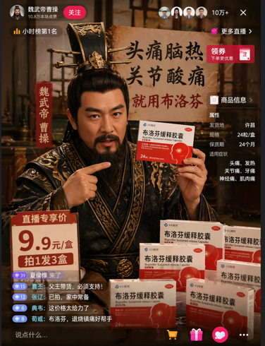
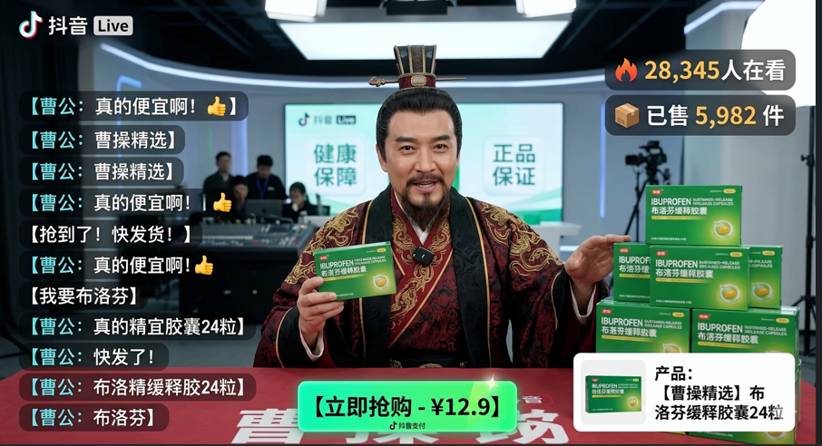
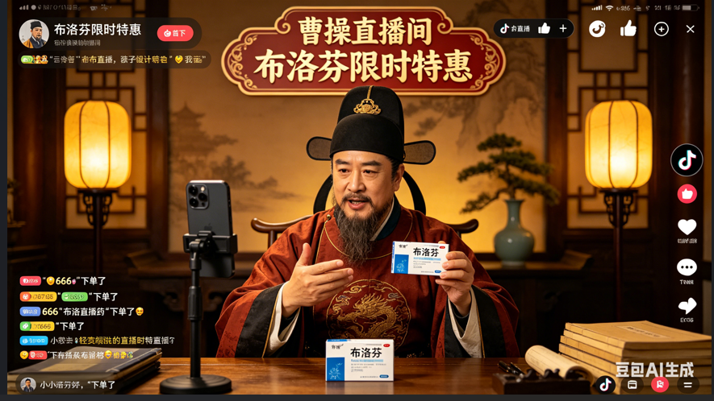
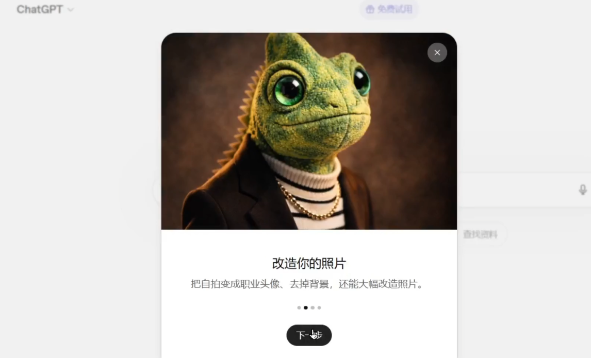
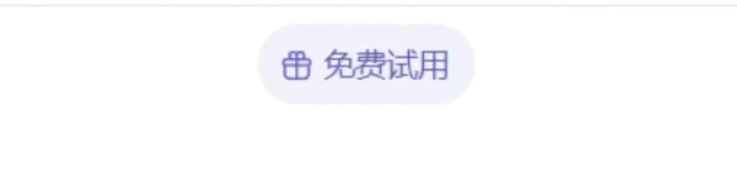
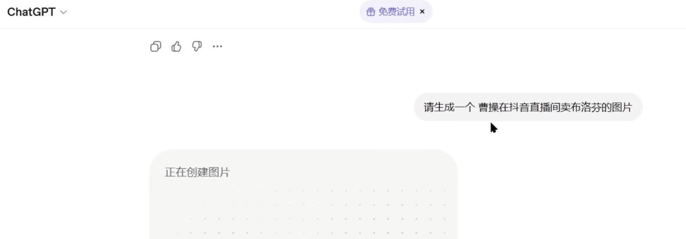
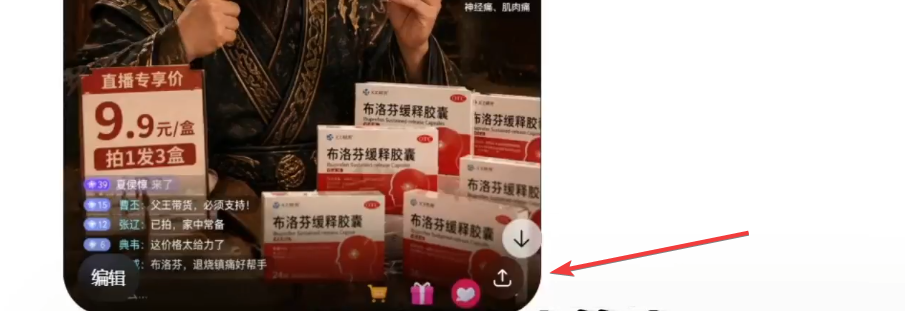
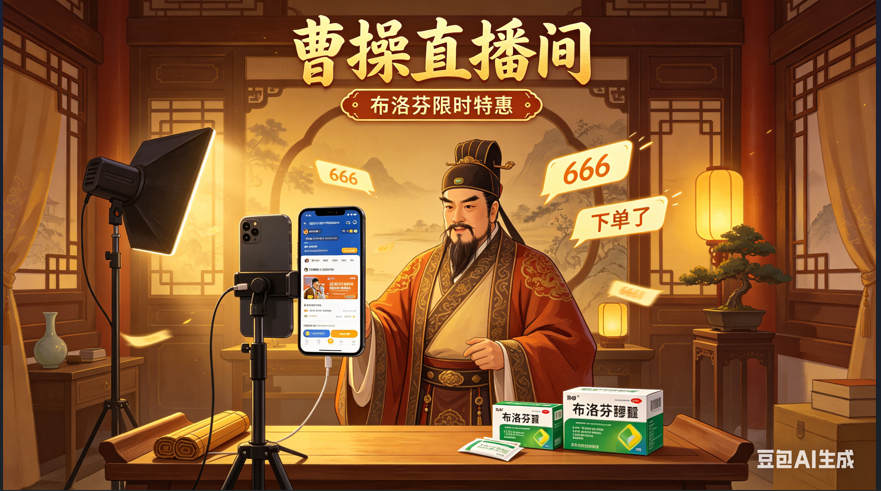
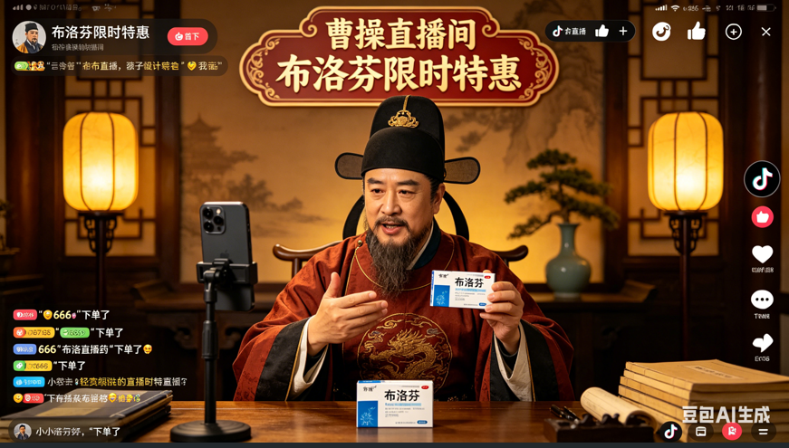

+++
date = '2026-04-24T09:13:39+08:00'
draft = false
title = 'GPT-Image-2 实测：与谷歌、豆包文生图效果对比'
tags = ['GPT-Image-2', '文生图', 'AI画图', 'ChatGPT', 'OpenAI', '豆包', 'Seedream', 'Imagen', 'AI工具', '图片生成']
description = '免费体验 OpenAI 最新文生图模型 GPT-Image-2，用「曹操抖音直播卖布洛芬」同一提示词，横向对比谷歌模型与豆包模型的生成效果，看看谁的细节更胜一筹。'
categories = ['AI相关']
+++

这个是image2 生成的图片。

这个是banana 生成的图片。

这个是豆包生成的图片。

大家觉得哪个图片更好一些呢？

最近，GPT-Image-2 刷屏网络，它是OpenAI公司最新发布的文生图模型。

只需要简单打几个字，就能帮你画出连专业摄影师都看不出破绽的照片。

真实感真的是拉满了。

所以，本IT博主对这个新模型的诞生也是倍感激动，迫不及待想体验一下这个工具。

## 1、初始界面

打开chatgpt官网，可以看到，官网这里已经推送了更新提示。

这里，我们只要点击下一步就可以了。

另外我们可以看到，这里我用的是免费版，并没有开通plus、pro会员。

所以说，免费的账户也可以体验 image2 的使用。

## 2、文生图步骤

接下来，我输入框里给了它一段提示词——“请生成一个曹操在抖音直播间卖布洛芬的图片”。

经过一番等待，图片就生成了。

点击小箭头这里，会有一个弹窗，点击下载就可以顺利地下载下来。

## 3、赏析图片

首先这个画面的布景和ui设计，做的非常逼真，跟抖音直播间是像素级别的复刻。

画面里的字体，个别做的不是很清晰，但大部分是很到位的。

直播间的头像和观众，略微有点瑕疵。

左上角头像这里，我个人感觉，有点像孔老夫子

然后，右上角这个人有点像奥地利落榜美术生。

大家觉得呢？

这里有一些细节，蛮搞笑的。

这里显示发货地是，许昌。这个挺符合历史背景的。

左下角这里是曹魏集团文官武将对老板的支持。

曹丕说：父王带货，必须支持！

张辽说：已拍，家中常备。

典韦说：这价格太给力了。

最后，这个图片是没有水印的，这也是一个优势吧。

## 4、对比

接下来，我们对比一下谷歌和豆包，生成的图片。

这里也是用的同样的提示词，我们先来看一下谷歌banana模型生成的效果如何。

ok，我们来赏析一下。

这里直播间的布景和ui细节，稍微弱了一些。

不是太像我们平时在抖音看到的直播间。

字体部分，我看着大部分都还可以。个别字体，没有展示出来。

然后，这里弹幕部分比较单一，只有曹公一个人在讲话。

感觉直播间人气不是很旺。

这里右下角有点别扭，它有个水印，这个毫无疑问是谷歌添加的水印。

接下来，我们看一下豆包生成的图片，我们用的是seedream 5.0 lite 模型，也是用的同样的提示词。

豆包比较给力，一次生成了四个图片。

我们挑两个来说一下吧。

这个图片就是动画风格。其实，跟我们的预期是完全不一样的。

我觉得，可能豆包模型是想试探一下我们，想让我们筛选自己想要的风格，然后再进一步沟通优化。

字体稍微有点瑕疵，胶囊两个字没有出来，有点像二维码。

这个官帽也不太对吧？！感觉像唐朝的官帽。有没有懂哥，评论区或者弹幕来指点一下。

然后，这个图片的话，相对来说比较符合预期。

这里的字体细节，有点问题。还有弹幕这里的显示，也是存在一些细节问题。

从人物形象来看，这个官帽也有问题。汉朝的官帽应该没有这个小翅膀的。

右下角这里，也是有水印。

---

OK，以上就是三个文生图模型，在同一个提示词下的表现。那你喜欢哪一个呢？欢迎在评论区发表你的看法。

下期再见，拜拜。

