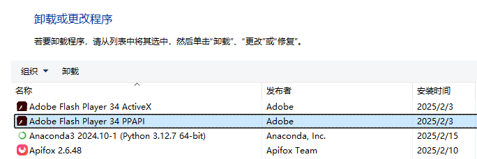
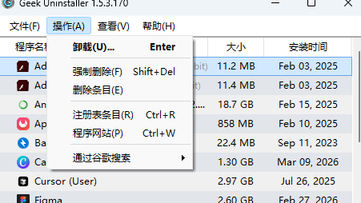
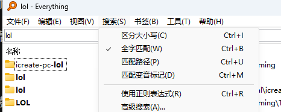
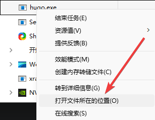

+++
date = '2026-04-04T12:09:17+08:00'
draft = false
title = 'Windows电脑如何彻底卸载软件？3个实用技巧告别系统残留'
tags = ['windows', '软件卸载', '电脑清理', '效率工具', 'geekuninstaller', 'everything', '教程']
description = '电脑软件卸载不干净，留下大量注册表和系统文件残留怎么办？本文分享3种Windows系统下彻底卸载软件的实用方法，介绍免费卸载神器 Geek Uninstaller、文件搜索工具 Everything 以及任务管理器的巧妙用法，帮你彻底清理系统垃圾，拯救硬盘空间。'
categories = ['IT工具']
+++

你是否会担心电脑里面的程序卸载不干净？

今天分享几个方式，帮助你彻底将程序卸载干净。

本文的方法适用于 windows 系统的电脑。

## 1、卸载不干净的问题

大部分人在卸载 win 系统的软件时，都会采用软件自带的卸载程序或者控制面板上的卸载程序。

采用这种方式卸载程序，会出现如下问题：

- 注册表残留 — 大量无用的注册表项
- AppData 文件夹未删除 — 用户数据、配置文件
- 临时文件 — 使用时产生的缓存
- 开机启动项 — 有些软件会留下启动残留
- 系统文件夹残留 — Program Files 里的零散文件
- 有些流氓软件甚至故意留下残留，比如：
  - 用户数据/配置文件 —— 方便你重装后恢复设置
  - 注册表项 —— 懒得清理
  - 后台服务 —— 某些软件卸载后还在偷偷运行

长此以往，会让你的硬盘，塞满各式各样的无用文件。而且，你也不知道这些文件到底有用没有，想删又不敢删。

接下来分享几个方法，帮助你清理“门户”。

## 2、geekuninstaller

geekuninstaller 是一个超级实用的、小巧玲珑的、免费的软件，它只有8MB大小。

可以帮助你彻底卸载，不想要的软件。

这个软件没有庞杂的内容，解压完之后，只有一个简单的可执行程序。

可以去它的官网，尝试下载使用一下——[geekuninstaller官网](https://geekuninstaller.com/)

它的操作界面清爽简洁，如下所示：

点击卸载之后，它会帮你清除软件、注册表、文件残留等软件数据，总之，就是帮你做一次全方位、无死角的软件大扫除。

## 3、everything

假如，我只是说假如，真有一些东西仍然没有卸载干净，那么，你可以尝试使用 everything 工具进行搜索，然后，再将搜索到的文件删除。

everything 是一款完全免费的搜索文件的软件（这些免费软件靠啥盈利呢？），大小仅有2MB。

它并不是一款用来卸载东西的软件，而是一个搜索工具。

win 系统自带的搜索功能，用起来太拉跨了，所以，借助这个软件进行搜索，是一个极佳的选择。

软件的操作界面极为简单，而且支持各种匹配模式的搜索。

如果你有想删除的文件，但又找不到它，你可以打开 everything 搜索关键词，找到之后将其手动删除。

这种方法可以帮助你清理干净软件残留物。

## 4、任务管理器

没错，你没有看错，任务管理器也可以帮助你清理程序。

我遇到过一个很令我难受的场景 —— 有一个软件 A 需要更新，我在它的官网下载更新了之后，居然在电脑上出现了两个同名的软件，一个 v1 版本，一个 v2 版本。

控制面板的卸载功能和 geekuninstaller 都没有找到 v1 版本的卸载入口。

于是，我调出了任务管理器，找到那个程序，点击右键，找到“文件所在位置”的选项，点击之后，就显示出了它所在的文件夹。

然后，把文件夹删掉就可以了。

---

以上就是本期分享，感谢观看。