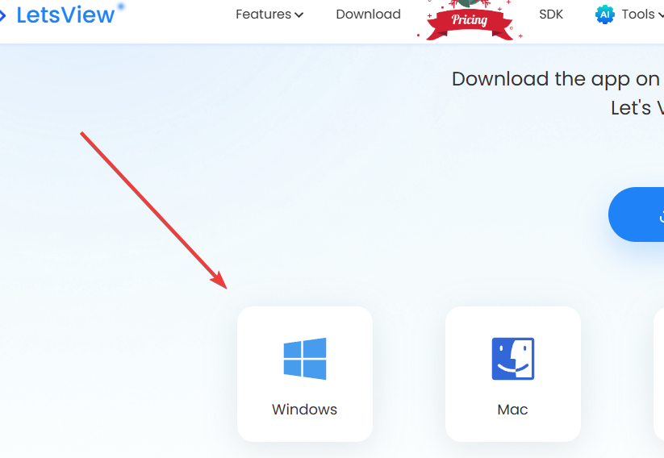
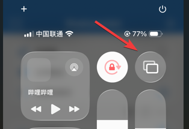
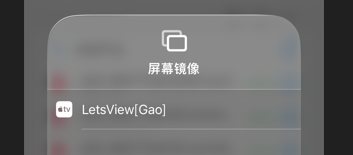
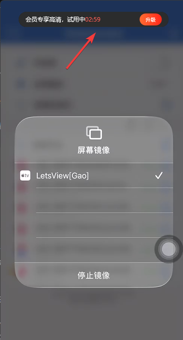
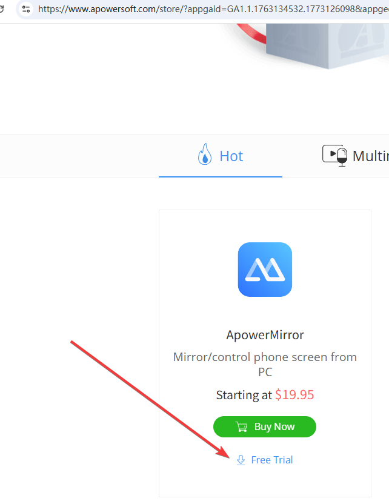
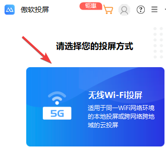
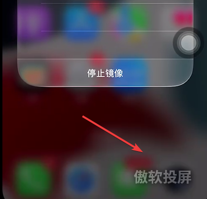

+++
date = '2026-04-05T09:33:22+08:00'
draft = false
title = '如何将iPhone免费投屏到Windows电脑？2款好用的投屏软件推荐'
tags = ['iPhone', 'Windows', '投屏', '屏幕镜像', 'LetsView', 'ApowerMirror', '效率工具']
description = '想要把 iPhone 手机屏幕投屏到 Windows 电脑？本文为你科普苹果与Windows的投屏协议差异，并强力推荐两款好用且免费的无线投屏软件（LetsView 与 ApowerMirror），无需在手机端安装App即可轻松搞定。'
categories = ['IT工具']
+++

很多人都会遇到这样的场景：想把 Iphone 手机的屏幕投屏到电脑上进行展示。

今天，给大家推荐两个好用且免费的软件，可以帮助你实现这个需求。

这里先科普一个小的知识点：

无线投屏需要用到传输协议。

windows 支持 Miracast 协议，苹果用的是 AirPlay 私有协议。

Airplay 协议仅在苹果自家的设备之间使用。所以，iPhone 连不上windows系统的屏幕。

所以，需要一些软件，帮助我们实现这样的功能。

## 第一个 letsview 

### 1.1 特点

- 简单易用，仅需在电脑端安装一份软件就可以了，无需在手机端安装任何app；
- 基础功能免费，例如：投屏；
- 高清投屏3分钟，3分钟之后，转为标清；
- 无水印；

### 1.2 安装和使用

#### - 安装

有这个需求的朋友可以去这个官网，访问并下载 —— [letsview官网](https://letsview.com/)。

然后，点击这里的windows图标进行下载。

下载完成之后，点击安装，然后，一直点下一步就可以了。

#### - 使用

安装完成之后，打开这个工具，无需点击任何东西，就这样挂着就可以了。

确保你的手机和你的电脑连接的是同一个wifi，或者同一个热点。

然后，在手机端点击镜像这里，你就能看到 letsview 的连接节点了。

点击之后，windows的屏幕上，就可以看到投屏的效果了。

请注意，这里给到了一个提示信息，大意是：高清会员试用3分钟。

我一开始，误认为只允许投屏三分钟。

后来才发现，它的意思是 —— 高清使用三分钟，三分钟之后，就不是高清投屏了。

我尝试等待了一下，个人感觉三分钟之后的投屏效果，勉强还行。

大家可以自行尝试一下，非常之简单。

## 第二个 ApowerMirror

### 2.1 特点

- 简单易用，仅需在电脑端安装一份软件就可以了，无需在手机端安装任何app；
- 基础功能免费，高清投屏10分钟，到时间后，会断开连接，需要用户重新接入；
- 有水印；

### 2.2 安装和使用

#### - 安装

避免雷同，安装环节不多说了，在官网下载、安装、使用即可 —— [ApowerMirror官网](https://www.apowersoft.com/store)。

#### - 使用

打开这个软件，选择wifi投屏。

然后，将手机跟电脑连到同一个wifi，或者同一个热点。

然后，手机选择屏幕镜像，会看到apower的节点，点击即可连接。

连接完成之后，电脑右下角会出现一个弹窗，显示剩余时间。

虽然有时间限制，但我认为影响并不大，你可以退出投屏，再进来就可以了，时间就会重新计时。

也就是，无线续杯。

投屏效果，我个人认为还是比较清晰的，大家可以自行体验。

另外，它的投屏界面的右下角会有一个水印。

这个水印问题，看你个人能否接受吧。

---

以上就是本期分享，感谢阅读。