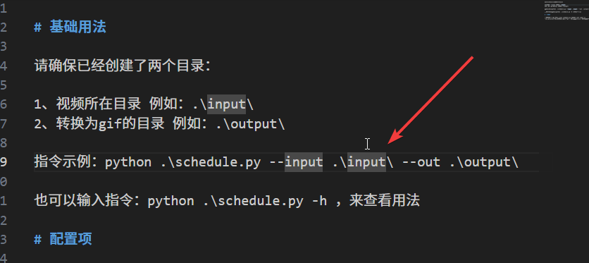

+++
date = '2026-03-13T11:09:55+08:00'
draft = false
title = '如何利用AI赚钱呢？实际经历分享如何使用AI编程、AI提示词，赚到第一桶“金”'
tags = ['AI赚钱', 'AI工具', '提示词工程', 'FFmpeg', '内容创作', '自媒体', '宠物赛道', '副业']
description = '摘要：本文复盘了我如何借助 AI 编程、FFmpeg 和提示词流程，把萌宠视频批量切片转成 GIF，用于宠物内容创作，并最终赚到第一笔 260 元收入。适合想做 AI 赚钱、副业、自媒体和内容变现的人参考。'
categories = ["AI相关"]
+++


本篇博客分享一下，我是如何通过ai工具和ai提示词赚到了“第一桶金”。（哈哈哈，说的有点夸张了）

这笔钱总计是：260多块钱，如下图所示。


## 1、灵感来源

我在网上冲浪的时候，发现一些宠物赛道的账号流量特别好，而且这些文章写的内容也很简单 —— 分享一些萌宠图片，然后吐槽一下。

如下图所示，这些文章的阅读量都达到了上万级别，而且每天都有上万的爆款！

<div style="text-align:center;">
  
  
  
</div>

所以，我也萌生了做宠物赛道的想法。

## 2、ai编程

方向定下来之后，我便开始了进一步的分析：如果在文章中使用简单的贴图，恐怕不够吸引人。

所以，我的想法是，从网上找萌宠视频转化为gif动图。

然后，把动图贴到文章里，而不仅仅是贴几张静态的jpg、png图片。

那么问题来了，有些视频比较长，如果全部转成一张gif，那这个文件就太大了。

因此，需要把视频切成多段，然后，分别转换成gif。

那么问题又来了，以上这一套流程 —— 裁视频转gif，如果纯手动操作的话，非常之麻烦。我想找一些现成的工具来完成这个工作。

但是，并没有找到。

于是，我借助ai编程，自己开发了这样一款软件。

简单介绍一下这个软件吧：

- 软件使用了免费开源的音视频解码工具——大名鼎鼎的ffmpeg
- 开发语言：python 3.12 
- 主要功能：使用命令行（下图所示），批量处理指定目录下的视频，然后，自动切割并转换为gif
- 次要功能：切割时间跨度可调，视频帧率可调，是否展示缩略图可调
- ai编程工具用的gpt 4.1




软件代码我已经上传至git平台: [裁剪视频转gif](https://github.com/mingyan1024/video2gif)

## 3、ai提示词

除了图片，文案也很重要。

我自己琢磨出来了一套 ai 提示词帮助我生成文案，提示词如下：

```
你是一个10万粉丝的 公众号 宠物赛道的博主。

擅长写宠物的 文章。

你年龄不大，是个20多岁的可爱的小女孩。喜欢看萌萌的，可爱的，宠物短视频以及图片。

并且，会吐槽这些可爱的小猫小狗。

下面有一个或多个内容，这些内容，是对萌宠图片的描述。

要求：

1、请给每一个内容，分别起两个标题。我会从中挑选一个，作为所有内容的总标题。标题字数至少15字，要能够吸引读者点击。标题要给人一种共鸣的感觉，就是那种“太像我家狗了”、“天啊我也有这种感觉”、“我要转给我朋友看”

2、请给每个内容，扩展生成两个生活中的故事，我会从中选择一个。你不需要提供完整的故事，只需要根据 遇到什么问题、经过是什么、结果是什么，给到我就可以了。不要用第一人称描述故事，要用第三人称，因为都是网友家的宠物。故事要能引起多数人的共鸣，能让人看完想评论。故事不要局限于我写的内容，我只是提供一个片段。

3、请给每个内容，生成一个 punch 的两句话，能戳中人心的那种，我会从中选一个。

4、请给每个内容，增加一个跟内容相关的宠物知识。风格：大白话，通俗易懂。这一部分内容，可以多写一些。另外，引入这个小知识的时候，前文与小知识之间，能有一个丝滑地过度。

5、不同的内容之间，请给我一些过渡的语句，让文章能丝滑、不突兀地顺下去。

6、请给每个内容加一些宠物的吐槽，就是宠物内心os。

7、请加两条网友的爆笑评论或者吐槽。


内容如下：

这个狗子实在是太绝了，居然会后空翻……

```

ai会根据我的提示词生成一堆内容，一定一定要注意：`千万不能把这些内容直接复制粘贴使用。` 要用自己的语言，把它写下来，否则，这个ai味就太浓了，会被平台判定为ai创作。


## 4、完整的sop流程

1. 找一段或者多段视频，保存在电脑上。
2. 执行软件，将该视频进行切割。
3. 根据视频内容，先自己简单写几句话。然后，把它们放到提示词那里，丢给ai帮你扩写。
4. 将ai生成的内容，转换为自己的语言放到你的文章里，然后，在合适的位置放上合适的图。
5. 发布文章


以上就是本期博客的完整内容，感谢阅读。


