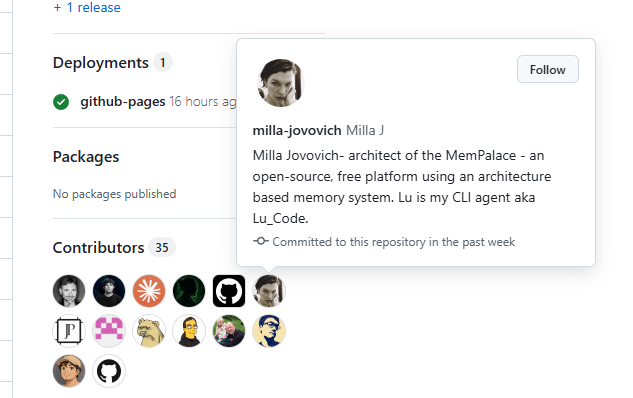
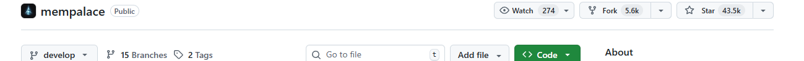
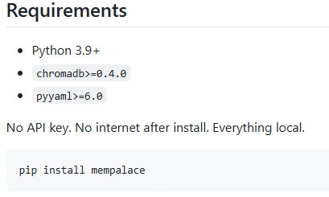
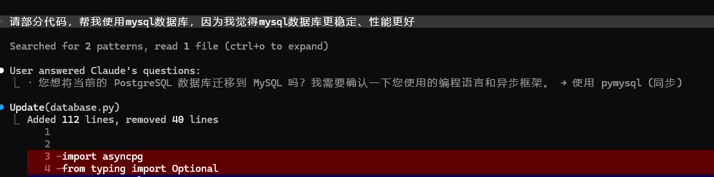
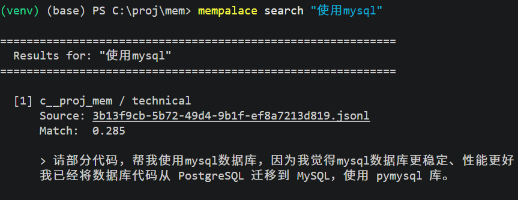

+++
date = '2026-04-13T09:37:40+08:00'
draft = false
title = 'MemPalace：让AI拥有本地记忆，无需API Key的开源解决方案'
tags = ["mempalace", "ai-agent", "claude-code", "python", "llm", "ai工具"]
description = 'MemPalace 是一款爆火 AI 圈的开源记忆工具，利用 SQLite 和 ChromaDB 实现完全本地化的 AI 记忆管理。本文介绍其安装方法及在 Claude Code 中的使用教程。'
categories = ['AI相关']
+++

万万没有想到，生化危机的女主角，居然成为了git大佬。

她参与的开源项目，MemPalace（记忆宫殿）爆火 AI 圈。



短短一周的时间，就已经收获了 4万+ 的stars。



这真的是我见过，玩跨界玩的最6的演员了。不得不感叹，这位真的是乘风破浪的姐姐。

```
项目地址参考如下：https://github.com/MemPalace/mempalace
```

## 1、痛点

该项目解决的最大痛点就是：ai没有记忆。

你每次打开新对话的时候，你会发现 ai 对你一无所知。

你之前跟它说过什么话，做过什么决定，踩过什么坑，在新一轮的对话中，ai通通忘记了。

虽然，也有一些云端解决方案，但是这些解决方案，通通要消耗 money。

因为你要把数据存到别人的服务器上，所以，安全性和成本，都是很棘手的问题。

**而MemPalace解决了这个问题。**

它使用SQLite作为轻量级数据库，处理知识图谱和时间的关系；使用 ChromaDB 作为向量数据库，处理存储和语义搜索；采用python作为开发语言，串起了整个项目。

也正因为它用了这些轻量化的本地工具，所以，正如它的项目介绍所言——一切都在本地，无需api key，无需外部网络。




## 2、安装 MemPalace

### 2.1 MemPalace工具安装

保证你的 python 版本在 3.9 以上。

输入一条指令，即可下载。

```
pip install mempalace
```

输入指令, 对当前项目进行初始化。

```
 mempalace init ./
```

输入指令，将当前项目存入记忆库。

```
mempalace mine ./

```


### 2.2 Claude Code 插件安装

输入两条指令，即可安装 MemPalace 插件。

```
claude plugin marketplace add milla-jovovich/mempalace

claude plugin install --scope user mempalace

```
## 3、使用 MemPalace

举个例子，这里我在 claude 中修改了我的项目，对项目中的内容进行了调整。



那么，过了一大段时间之后，我们可能已经忘记了这一部分调整的原因。

接下来，我们使用 MemPalace 进行回想。

```
找到 .claude 对应的项目，输入如下指令：

mempalace mine C:\Users\Gao\.claude\projects\C--proj-mem --mode convos
```

接下来，我们使用`mempalace search "使用mysql"`。瞬间就能找到，当时使用mysql数据库的原因。




---

以上就是mempalace的基础用法，感谢阅读。


