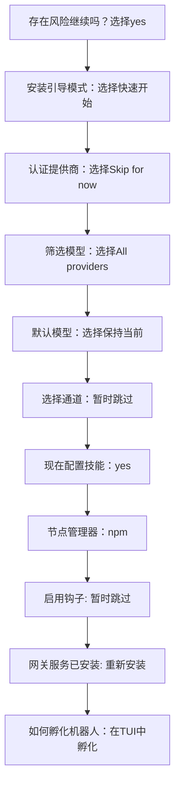
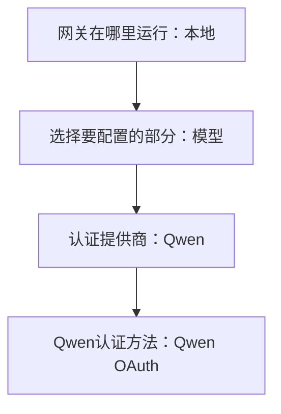
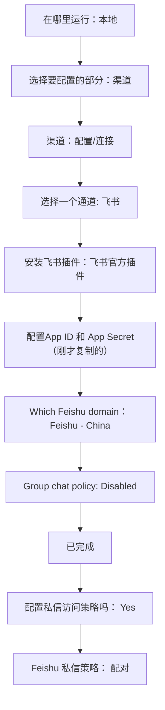
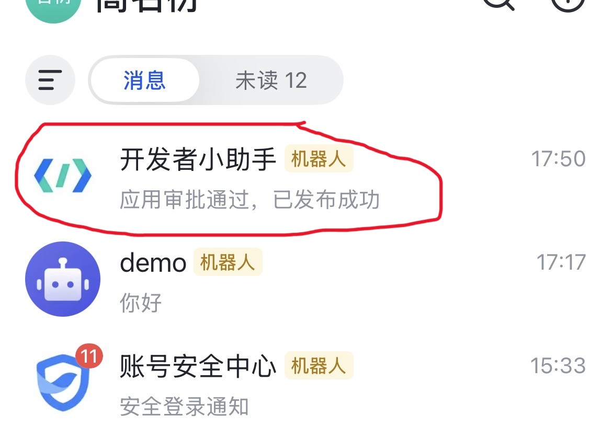
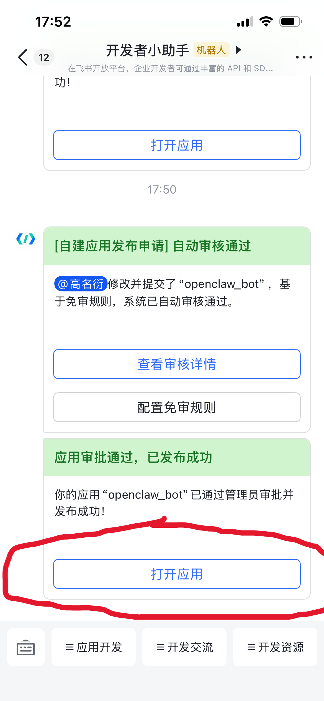
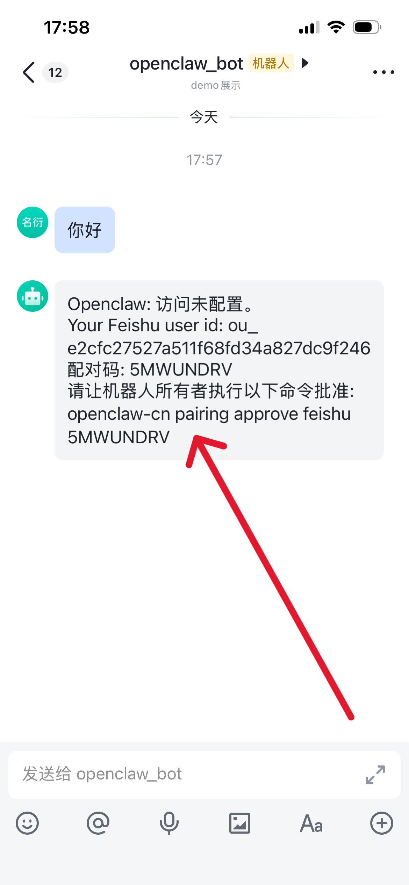
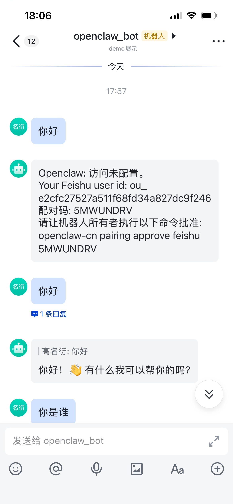
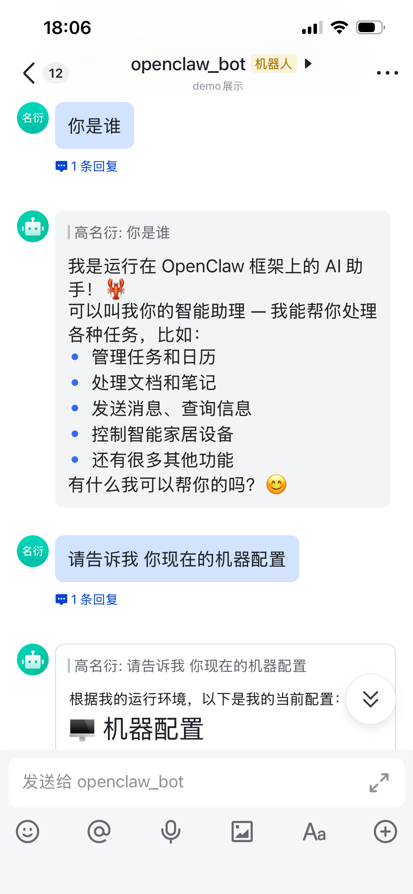

+++
date = '2026-03-05T18:08:50+08:00'
draft = false
title = '最新 OpenClaw 安装配置全攻略：Windows本地部署+接入飞书保姆级教程，一步一步教你实现'
tags = ["OpenClaw", "AI Agent", "建站教程", "Windows部署", "WSL", "飞书机器人", "Qwen", "本地大模型"]
description = "摘要：本文手把手教你在 Windows 系统下安装和配置 OpenClaw 中文社区版，并接入飞书机器人。本教程涵盖基础部署、本地控制台设置、Qwen大模型无缝对接以及飞书机器人的完整接入流程，助你快速打造专属 AI Agent。"
categories = ["AI相关"]
+++

OpenClaw 是 IT 圈 2026 年开年的绝对顶流，在之前的文章中 [《AI Agent是什么？从概念原理到开发实战全解析》](https://gaomian.org/posts/ai-agent/)，笔者详细分析了 OpenClaw 以及 ai agent 的本质。

本篇文章将手把手教你如何搭建和使用 OpenClaw 。虽然官网有教程，但在实际操作中依然会存在一些坑。

请注意：本教程仅针对windows系统；本教程安装的是 OpenClaw 中文社区版本，该版本对中文用户更加友好，并且它未对原版 OpenClaw 进行阉割处理，请放心使用。

## 1、安装步骤

### 1.1 启动wsl

输入 `wsl --list` 指令查看可用的 linux 系统。

输入 `wsl -d Ubuntu` 指令，启动一个 linux 系统。
-1.png>)

请注意：wsl 是在 win 系统下创建linux子系统的工具，该工具好处颇多；如果不会使用wsl，请参考这篇文章[《告别笨重的虚拟机！Windows系统使用WSL优雅运行Linux全攻略》](https://gaomian.org/posts/wsl/)

### 1.2 指令安装

先尝试 `ping 一下 百度、clawd.org.cn` 等网站，看网络是否通畅。

-1.png>)

然后，输入 `sudo su` 指令，进入超级管理员的权限，linux 系统会提示你输入用户名和密码，跟着提示走就可以了。

网络没有问题后，输入 `curl -fsSL https://clawd.org.cn/install.sh | bash -s -- --no-onboard` 进行安装。

-1.png>)

稍等一段时间，直到看到下面的安装完成，就 OK 啦。

-1.png)

至此都非常的简单，请做好心理准备，后面就是复杂的内容了。

## 2、配置 OpenClaw

### 2.1 配置 OpenClaw 本地工具

输入 `openclaw-cn onboard` 指令开始配置。

-1.png)

配置界面会给你一堆提示和选项，你可以参考下面：

按照以上流程配置完成之后，你会看到如下的界面。

-1.png)

在命令行终端，连续按多次 `ctrl+c` 就可以退出这个配置页面。

然后，输入 `openclaw-cn dashboard --no-open`, 用浏览器访问 ` http://127.0.0.1:18789/?token=xxxxxxxxxx` , 你会看到如下网页。
-1.png)

-1.png)

这个页面是你本地启动起来的一个 OpenClaw 的控制台页面。

那么，目前为止已经取得了阶段性的“胜利”，离最终形态还有一小点距离。

### 2.2 配置ai大模型

ai 模型是 OpenClaw 的“大脑”，接下来要给这个工具配置一个ai大模型。

输入 `openclaw-cn configure` 指令，进入配置界面，如下所示：

-1.png)

然后，按照下面的流程进行操作。

如果你跟本教程一样，选择了 QWen 模型，那么你会看到下面的展示。

-1.png)

根据箭头处的链接指引，在浏览器上打开该页面进行验证操作。没有账号的话，可以用邮箱注册一个账号，非常方便。

-1.png)

-1.png)

认证完成之后，回到命令行界面，你已经可以看到模型名称了。然后，回车确定就可以了。

-1.png)

再次回到 OpenClaw 的控制台，你可以尝试跟你的 OpenClaw 进行对话。

-1.png)

## 3、搭配app

OpenClaw 这一端已经搞定了，现在我们进入最后一个步骤——接入飞书机器人。

### 3.1 创建应用

用浏览器打开飞书平台，登录该平台并创建应用。

-1.png)

给即将创建的应用，填写一些简单的描述。

-1.png)

填写完成之后，进入控制台页面，在左侧导航“添加应用能力”那里，添加机器人。

-1.png)

在左侧“凭证与基础信息”那里，把 app id 和 app secret 保存下来。

-1.png)

### 3.2 OpenClaw添加appid、appsecret

输入 `openclaw-cn configure` 进入 OpenClaw 配置界面。

-1.png)

按照下面的流程，进行操作。

### 3.3 飞书开通权限

回到飞书的控制台，在左侧导航那里找到“事件与回调”，然后，在订阅方式那里，选择长连接，保存。

-1.png)

然后，点击右侧的添加事件，搜索 “im”。然后，按图中所示，进行勾选并确认添加。

-1.png)

出现确认开通权限的弹窗，同样点击确认。

-1.png)

左侧导航栏找到“权限管理”，点击开通权限，搜索“通讯录”。如下图所示，把“获取通讯录基本信息”勾选上，然后确认开通权限。

-1.png)

继续点击开通权限，搜索框输入 "im:"，如下图所示，全选之后点击确认开通。

-1.png)

左侧导航栏找到“版本管理与发布”，点击创建版本。

-1.png)

输入版本号和更新说明，然后，点击保存，然后，确认发布。

-1.png)

-1.png)

### 3.4 OpenClaw 与 Feishu配对

我在实际操作中，发现配对的时候，会出现以下这有两种情况。二者选其一即可（如果其中一种方式不行，就换另一种方式）。

请读者自行参考：

a、回到命令行终端，输入 `openclaw-cn pairing list feishu` 查看待配对的应用。

-1.png)

把第一列的 Code 复制一下，贴到这个指令下 `openclaw-cn pairing approve feishu XJ123456` 进行配对。

-1.png)

b、在飞书端进行匹配

打开飞书app，找到开发者小助手。

点击进来之后，再点击打开应用。

找到下图“命令批准”这里，复制下来 `openclaw-cn pairing .......` 这一行内容，然后，丢到命令行里面去执行，就可以完成配对了。

不管用方法 a还是b，匹配完成之后，就可以进行对话了。

### 3.5 待机重启

win系统一段时间不用之后，系统就会待机。待机可能会造成 OpenClaw 服务中断。

这个时候，你给机器人发信息，机器人无法响应你。

所以，你要重新启动一下网关，输入`openclaw-cn gateway restart` 指令就可以了。

-1.png)

很多人喜欢用 mac mini 或者租一个服务器，用来跑 OpenClaw ，也是这个原因。这些设备能耗比较低，而且可以 7*24 小时，稳定在线运转 OpenClaw。

***

以上就是安装、搭建以及使用 OpenClaw 的全部过程。感谢阅读。

