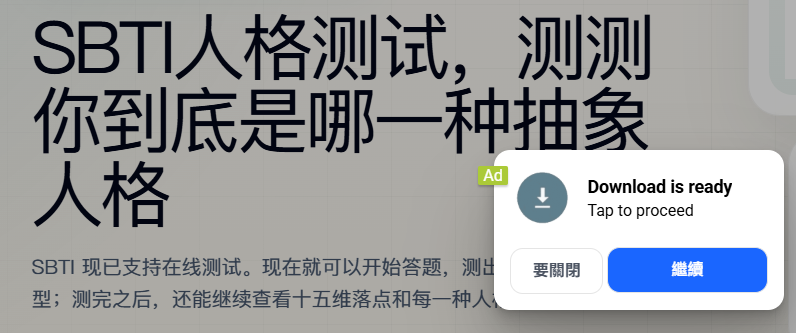

+++
date = '2026-04-11T23:07:00+08:00'
draft = false
title = '从 sbti 模仿网站看透 Google AdSense：流量才是通过审核的核心'
tags = ['google-adsense', 'sbti', 'seo', 'web建站', '流量']
description = 'sbti 话题爆火后，sbti.dev 在一两天内就挂上了 Google 广告。没有隐私声明，没有联系方式，却成功通过审核。本文深度分析这个案例，揭示流量对 Google AdSense 申请的决定性作用。'
categories = ['IT杂谈']
+++

在上一期文章里面，我分析了一下sbti网站，以及各种衍生网站。

但是，有个事情一直酝酿在我的脑海里，文章篇幅有限，没有跟大家说。

那就是，我发现了接入 google adsense 一个超级有效的思路，那就是 —— 流量为王。

不知道大家对流量为王，这四个字，有没有更加清晰地认识，接下来，我会分析一下。

## 1、分析网站

这个网站（sbti.dev），并非原创网站，原创网站是 sbit.unun.dev ，其余的都是模仿……

但是，它已经挂上谷歌广告了。

它的亮点在哪里？就是流量二字。“sbti”火了，就把它带火了。

它违反了 google adsense 的原创性原则，但它依然接入了google adsense。

另外，它的域名后缀是 dev ，所以，并不是说，非要 com 后缀的，才会更加轻松地通过率。

## 2、网页内容

没有隐私保护声明，没有联系方式声明，只有一个简单的网站介绍信息。

这些声明，我查了一些帖子说是要有，但是这个网站通通都没有，但并不妨碍，它已经挂上了google 广告。

## 3、时间线梳理

sbti 这个话题是在4月9号火的。

然后，这个网站是4月10号晚上就已经挂上了。

一两天的时间，就可以挂上广告了，足以见得速度之快

---

写在最后的一点感悟：

分析了这么多，只是希望大家能看到流量对于申请谷歌广告的重要性，并不是鼓励大家也这么去做。

网站里面该有的东西还是要有。比方说，隐私保护、网站负责人联系方式（邮箱）。

个例的成功，并不具备普世价值。虽然，它行之有效，但终究不是成事的方法。

因为商业化的东西，最忌讳原样模仿，也许这次侥幸通过了，那么下一个就会栽跟头，这何尝不是一种成本呢？

我们可以去蹭热点，但是热点的东西，一定要“穿”过你的身体，留下你的思考痕迹。别人的东西，加上你的想法，那就是你的东西。

当然，在这个过程中，我们肯定还是要追求有深度的想法。

感谢阅读，下期再见。

