+++
date = '2026-04-10T10:14:03+08:00'
draft = false
title = 'SBTI网站技术解析：Next.js + Vercel + Cloudflare 零成本建站实践'
tags = ['nextjs', 'vercel', 'cloudflare', 'web建站', '技术分析', '独立开发', '免费托管', 'sbti']
description = '从爆火的SBTI网站出发，深度分析其 Next.js 技术栈、数据库选型、Vercel 部署方案与 Cloudflare 域名托管，顺带拆解独立开发者如何用近零成本快速搭建并变现一个 MVP 网站。'
categories = ['IT杂谈']
+++

分析sbti网站，我发现了很多好玩的事情。

比方说，你在必应搜索的时候，你会看到很多复刻的版本。

全是模仿李逵的李鬼。

大家都在自己的网站上，挂这个东西，来增加自己网站的流量。

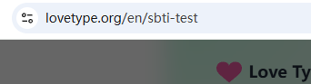

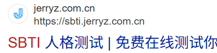

（sbti.unun.dev ，这个才是原作者的网站）

域名要从后往前读，最后面的，级别最高，范围最大。

去掉最左侧的前缀（也就是子域名sbti），我们甚至可以访问到原作者的博客。

本文不谈原作者网站，我们以其中一个“李鬼”做一下赏析。

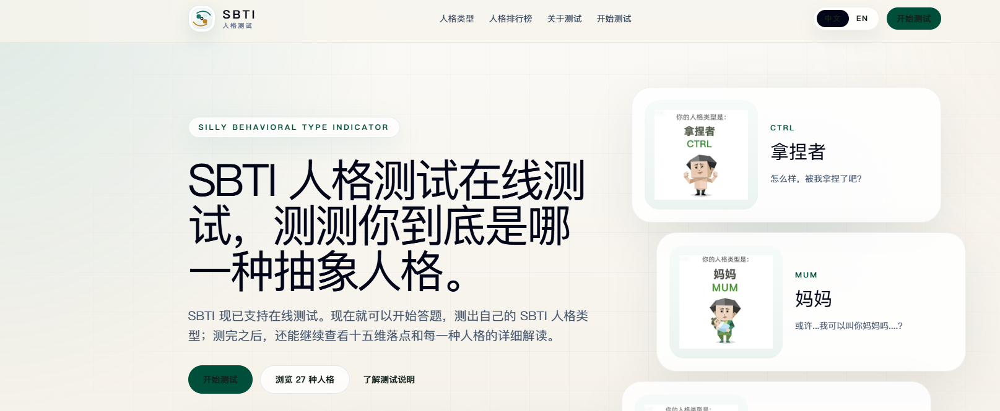

## 0、网页设计

这个网站的网页设计比较简单，给我的感觉就是 ai 味很浓。

可以看到，它的这个大标题设计、小标题、还有卡片的设计，都是 ai 设计网页的一个常见套路。

人物插画的设计，我觉得是个亮点，有种呆萌呆萌的感觉，情绪给的很到位。当然了，这是原作者的功劳。

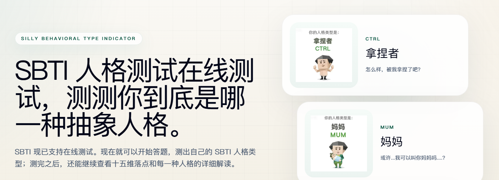

这里使用了格林威治时间，因为这个网站全球都可以访问，如果大家都按自己的当地时间提交记录的话，那就会造成混乱。

你是早上八点提交的，过了两个小时，另外一个地方的人，也是早上八点，这就乱了。

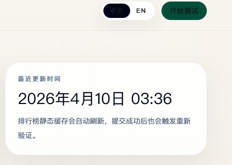

（这个地方，网站略做了改动，跟我上午看到的完全不一样，已经改为北京时间了）

这里我还看到了 google 广告的脚本。

4月9日这个 sbti 梗开始火的。然后，今天10号，就准备挂广告了？！这变现速度真够快的。

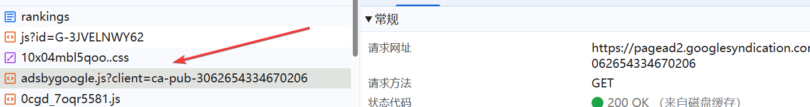

但是，页面上没有显示任何广告，我猜测应该是 google 还在审核吧，而且，我觉得大概率是很难审核通过的，毕竟这不是原创的网站。

## 1、开发架构

这个网站的开发框架，用的是 nextjs 。

nextjs 是建立在 react 上的一个全栈框架，而 react 是一个前端开发库。

通过，chrome 插件我们可以一窥究竟。

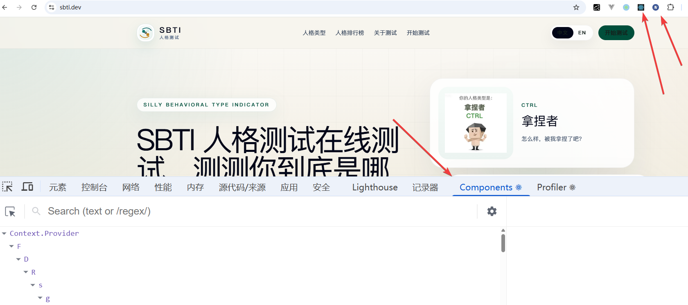

这里有提交记录和排行榜，那么在整体架构中肯定会有数据库，至于用的什么数据库就不太清楚了。

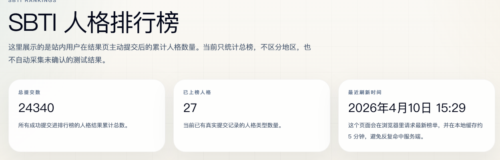

数据库的话，也有免费的平台，例如 Supabase、PlanetScale、Neon、Vercel Postgres。

这些平台虽然免费，但是免费额度有限，可以用在项目的初始阶段，做个 mvp （Minimum Viable Product，最小可行产品） 。

如果项目火了之后，再考虑付费扩容。

排行榜，这里它用了一个缓存设计，目的是提高网页的响应速度。

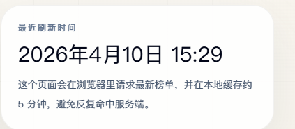

因为，如果都从数据库拿数据的话，这个数据库就吃不消了。

网站作者把数据存在了用户本地。

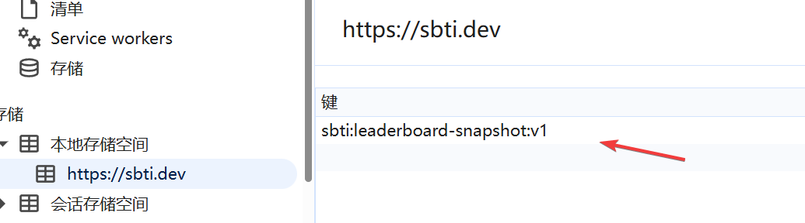

这里我觉得做得很不好。

时间和排名都放在了本地。

刷新页面的时候，你会发现，时间不是实时的，排名就更不是了。

时间至少可以做一个实时的吧，排名可以做一个服务端的缓存，而不是把这一堆数据放在用户本地。

## 2、部署 vercel

通过解析响应头，我们可以看到这个网站它是用 vercel 进行的部署。

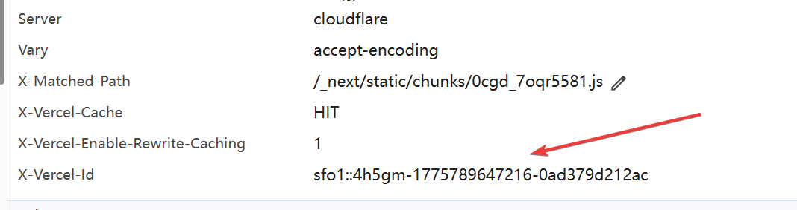

vercel 是一个网站托管平台，如果说，你的网站内容很少，可以放在这个平台上部署，不花钱。

当然了，如果你的网站非常复杂的话，肯定是要花钱了。

## 3、cloudflare托管

这个网站的域名是dev后缀，

通过 whois 这个工具以及响应头的提示信息，我们看到，网站是托管在了 cloudflare 平台。

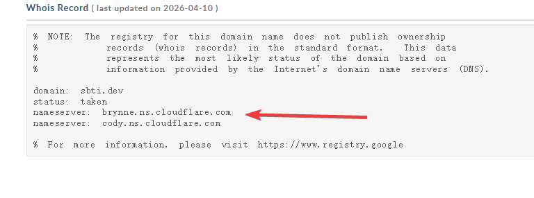

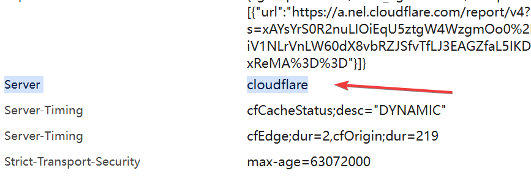

cloudflare 平台，可以免费接入 https，免费帮你进行 ddos 防护，免费提供 cdn 服务……

反正，小网站的基础服务都免费。

## 4、成本分析

初期：服务器部署 0 元，数据库 0 元，域名大约 100/年，AI 工具 token 120元一个月。

---

大概就是这样咯。感谢观看。

