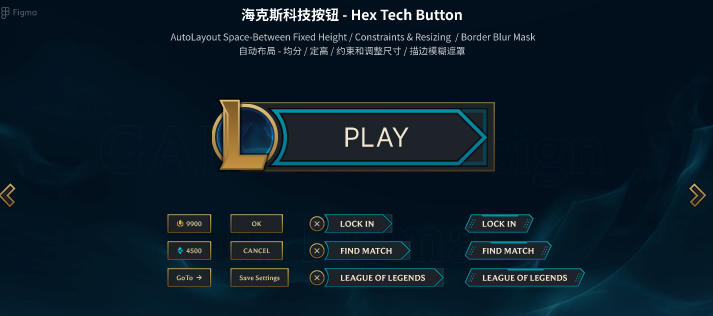
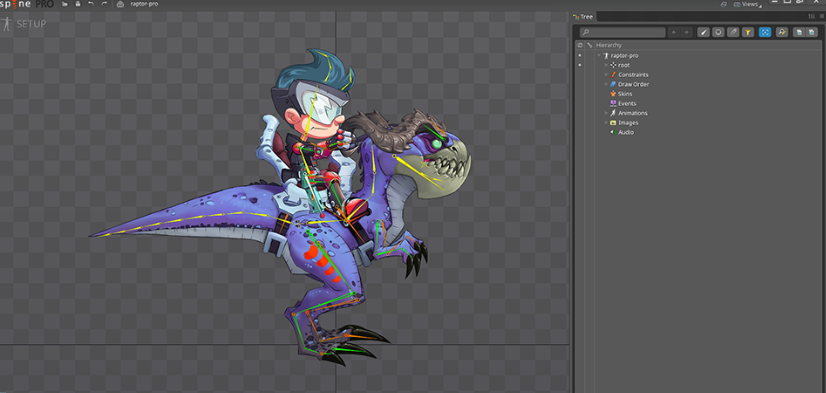

+++
date = '2026-04-07T09:01:23+08:00'
draft = false
title = '一个人怎么做游戏？零基础独立游戏开发全流程与必备工具合集'
tags = ['游戏开发教程', '个人游戏开发', '游戏制作', 'AI画图', 'Aseprite', '游戏音效', '免费素材']
description = '想自己一个人开发游戏却无从下手？本文带你快速理清个人游戏开发（Solo Game Development）的完整流程。从核心玩法设计、原型验证，到2D美术绘制、骨骼动画制作，再到免费音频素材寻找与引擎开发，为你提供一套完整的低成本/零成本游戏开发工具链解决方案。'
categories = ['游戏开发']
+++

上一篇文章，讲解了一下游戏引擎、游戏发布的相关知识。

这一期文章讲一下，游戏开发（主要是独立开发）有哪些重要的环节，以及有哪些会用到的工具。

## 1、游戏设计

游戏设计肯定是游戏开发的第一个环节。

你是要做一个格斗类，还是闯关类的游戏，战斗规则是怎样的，道具逻辑怎么安排，都需要在这个环节考虑清楚。

总之，就是把这个游戏的核心玩法想明白。

在这个环节，你可能会用到：

- 笔记工具 例如，notion、obsidian、腾讯文档等等，主要目的是把想法记录下来；

- 画图工具 例如，Miro，Figma等等，主要目的是把系统结构和流程画出来；

这个环节，没有特别严格的规范和要求，甭管用什么方法和工具，哪怕手写都可以，只要能把你的想法清晰地落在纸面上就ok了。

## 2、原型验证

这个环节，简单来说，就是根据第一步的设计，开发出来一个demo，先内部体验一下。

如果好的话，就继续做；如果不好的话，就不再继续。

这个环节，用到的主要工具是一些开发引擎，包括：godot、unity。

如果你是个人游戏开发者，或者仅仅是一个学习者，那么这个环节可以忽略。

## 3、美术设计

美术设计的含金量，我想无须多言了。

你能看到的所有东西都是在这个环节做出来的，例如：游戏的主菜单界面、游戏人物、人物移动、人物攻击、技能效果等等。

### 3.1 菜单界面

游戏菜单界面的设计，可以采用 figma 工具进行设计。

你可以用 figma 来做一些 button、icon，然后像拼积木一样，把这些元素铺在界面上，例子如下：

那么，游戏内容该通过哪些工具和方法制作呢？

从视觉观感来看，游戏可以分为 2D 和 3D 。

### 3.2 2D 游戏

作为初学者，肯定是要先学 2D 游戏的制作。

理由：不需要学建模；不需要理解三维空间、摄像光照；素材是png图片，好理解；能够快速出成果，几天就能搞一款游戏……

在 2D 游戏的制作中，你需要绘制出游戏素材。就拿格斗游戏来说，你需要绘制人物移动的素材，人物攻击的素材，人物特效的素材等等。

但也不必每一帧动画都绘制，只需要把关键帧绘制出来就可以了，比如走路：左脚迈出去、双脚并拢、右脚迈出去、双脚并拢，就这4帧图片即可。

引擎循环播放就会渲染出走路动画了。

#### 2D 绘制工具如下：

- Aseprite [项目链接](https://github.com/aseprite/aseprite) 像素风格游戏专用绘制工具，软件费用大概20美元，如果不想花钱也可以，你可以在 git 上，自行下载代码并将它编译出来；

- Photoshop 专业的绘图工具，游戏绘图也可以做，软件需要收费，而且还挺贵；

- Krita [项目链接](https://krita.org/zh-cn/)  类似ps的全能绘图工具，可以做游戏绘图，免费开源；

#### 2D 骨骼动画工具如下：

这里先说下什么是骨骼动画工具 —— 它是给角色装骨架的软件。

我们可以把画好的角色部件（头、身体、手、脚）导入进来，然后，在软件里给这些部件装上虚拟骨架，摆几个关键姿势，软件就可以自动补出中间的过渡动作。

相比于上面提到的 2D绘制工具来说，它的优点是：不需要一帧一帧画，省了大量工作量。

推荐工具如下：

- spine [项目链接](https://zh.esotericsoftware.com/) 功能强大，收费，而且比较贵；

- LoongBones [项目链接](https://www.loongbones.com/)  7天免费试用，功能够用，适合初学者；

- Godot 内置工具 免费，基础功能易学好用，适合新手，高级功能比较麻烦，诟病较多；

2D绘制工具，绘制完成之后，会输出关键帧素材图片（png格式）。

2D骨骼工具，绘制完成之后，会输出部件的素材图片（png格式）以及json文件（记录部件运动）。

这些素材交付给游戏引擎渲染，就会出现动画的效果了。

### 3.3 3D绘制

3D 游戏相比于 2D 更复杂一些，这里先挖个坑，先把 2D 游戏制作梳理清楚，以后有机会再讲……

### 3.4 素材网站

作为初学者，如果你觉得亲自操刀有点麻烦，可以在素材网站上下载你想要的素材。

网站如下：

- kenney.nl 质量高，免费，独立开发者必备网站；
- itch.io 免费素材、付费素材都有；
- OpenGameArt.org 免费素材库，种类丰富；
- unity社区 付费免费都有；

### 3.5 AI制作素材

AI 制作素材的优势是出图快，适合于图标、背景图的制作。

AI 制作素材的劣势是，制作游戏人物的时候，很难做到人物形象的统一。同样的提示词，两次生成出来的人物，可能长得不一样，需要手动进行调整。

ai生成图片的工具有：

- midjourney 质量高风格好看，需要花钱订阅；
- Stable Diffusion 免费开源，配置麻烦，需要一定门槛；
- 豆包文生图、Nano Banana 等文生图工具；

## 4、音频制作

音频制作分为两个大模块：音效（SFX）、背景音乐（BGM）。

获取游戏音乐的方式主要有如下两种：

### 4.1 自己制作音乐

需要乐理基础，工具：GarageBand（Mac免费）、FL Studio、Audacity。

一般来讲，很少有人（特别是初学者）会选择这个方式吧？这一part就过了哈。

### 4.2 素材库

可以直接使用素材库的资源，给游戏配乐和配音效。

- freesound.org 最大的免费音效库；
- Kenney.nl 有免费音效包；
- itch.io 有免费音频素材；
- 爱给网 国内最大的音效库；

对于新手来说，游戏的音乐和音效，就从素材网站，按需下载就可以了。

## 5、游戏制作和发布

游戏制作会用到游戏引擎，在上一篇文章里（[游戏引擎和游戏发布](https://gaomian.org/posts/game-dev-tech-overview/)），我已经详细介绍了游戏引擎和游戏发布用到的平台，这里就不再赘述了。

再简单提一句吧，游戏制作就是借助游戏引擎将上面提到所有东西组合起来：

- 把美术素材导入引擎
- 写代码实现游戏逻辑
- 把音效绑定到对应事件
- 做UI界面
- 调整数值和手感

制作完成之后，编译打包，生成一个可执行程序（也就是游戏），发布到平台，就OK了。

---

以上就是本期分享，感谢观看。

