+++
date = '2026-03-08T11:10:05+08:00'
draft = false
title = '什么是 CI/CD？结合 GitHub Actions 与 Hugo 的自动化部署教程，手把手教你使用'
description = '摘要：用通俗易懂的语言，讲解了 CI/CD 的核心概念，并通过真实案例，手把手教你如何使用 GitHub Actions 将 Hugo 博客自动部署到云服务器。'
tags = ['CI/CD', 'GitHub Actions', 'Hugo', '自动化部署', 'DevOps']
categories = ['web开发']
+++


`CI/CD`这个工具，很早就出现了，相信很多读者（也包括我自己），在工作中经常会用到它。

cicd 可以说是，每个互联网人必须要懂的一个“技能”。

不过，工作中我们用到的 cicd 平台，都是大佬们已经搭建好的。

这可能导致你对这个工具，理解的不那么透彻。

今天我用通俗易懂地语言来讲透 `cicd` 这个工具，并通过一个项目实战案例，分享一下如何从0到1使用这个工具。

# 1、ci/cd简史

ci/cd 是两个词：

ci，`Continuous Integration（持续集成）`

cd，`Continuous Delivery（持续交付）或 Continuous Deployment（持续部署）`。

## 1.1 ci

`ci`这个概念，早在上世纪九十年代（1990年）就已经提出来了（那个时候还没有git）。

提出这个概念的主要目的，就是希望解决合并代码时，出现的混乱问题——过去程序员做开发，几个月才会合一次代码。

你敢想象吗？几个月合一次代码，这里面的代码冲突、代码bug，还有调试的工作量，得有多恐怖。

所以，就有人提出了`持续集成`的说法：我们可以频繁合并代码，不必等几个月之后再合并。

于是，一系列有助于提交代码、合并代码的工具就诞生了。

再后来（2000年之后），`git` 工具的出现，又进一步优化了集成代码的体验。

## 1.2 cd

在集成代码的问题解决之后，聪明的人类又进一步思考 —— `部署`的流程是不是也可以简化一下呢？比方说，我们提交完代码之后，是不是可以直接在测试环境里跑一下呢？

于是， `cd` 的概念就出现了。它的主要目的，就是希望提交完代码之后，自动部署到服务器上。

2000年初，云服务还没有出现的时候，大家都用物理机，装个系统、装个统一的环境，十分之复杂。所以，要想做到自动化部署，难度是比较大的。

到了2010年左右，云计算出现了，配置服务器便捷了很多，装系统、配置环境也十分方便，鼠标点一点就可以配置一台云服务器。

因此，`cd` 这个概念也逐渐地普及开来，出现了很多工具方便开发人员集成代码和部署服务。例如，`GitLab CI/CD`，`蓝盾`,`Jenkins`,`GitHub Actions`。

总的来说，`ci`解决了代码集成的痛苦，`cd` 解决了软件发布的痛苦。


# 2、cicd 使用

下面通过一个项目实战案例，讲解一下如何从0到1部署一个 cicd 工具。

我先介绍一下项目背景：

* 博客项目
* 项目在本地开发，然后发布在云服务器
* 项目使用github仓库存储代码、github action 跑cicd

吐槽一下：假设没有cicd工具，每次更新博客的时候，就需要把博客的网页代码，手动上传到服务器上，如下图所示，又麻烦又慢，效率十分低下。

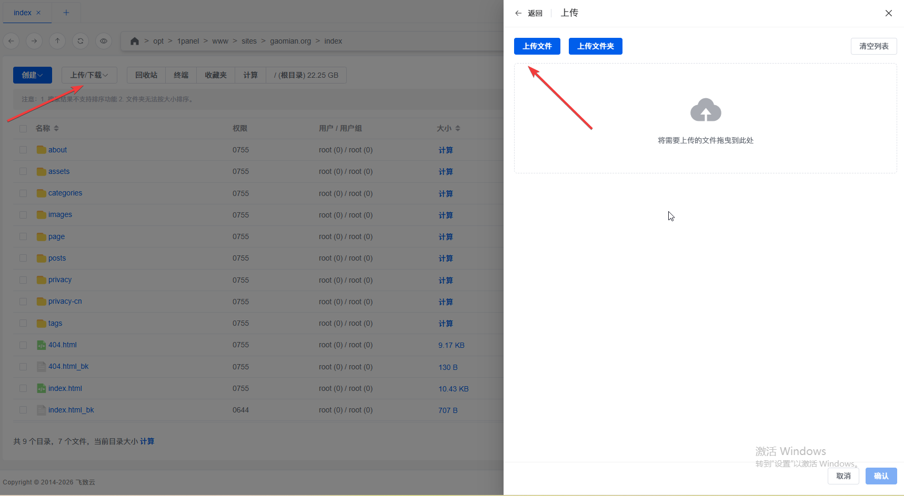

下面，我将借助 GitHub Action 这个 cicd 工具，解决一下这个问题。

## 2.1 打通git和你的服务器

先做个简单的梳理：

目前总共有三个端——本地电脑，git平台，远端服务器。本地电脑可以上传代码到git，本地电脑可以访问服务器，这些链路是完全畅通的。

但是，git与服务器，是不通的。

所以，需要添加验证信息，打通git和服务器之间的链路。

### 第一步

在 windows 系统的 cmd 下执行命令`ssh-keygen -t ed25519 -C "git_actions" -f C:\Users\Gao\.ssh\git_actions`

一路回车，就会生成密钥对，如下所示：

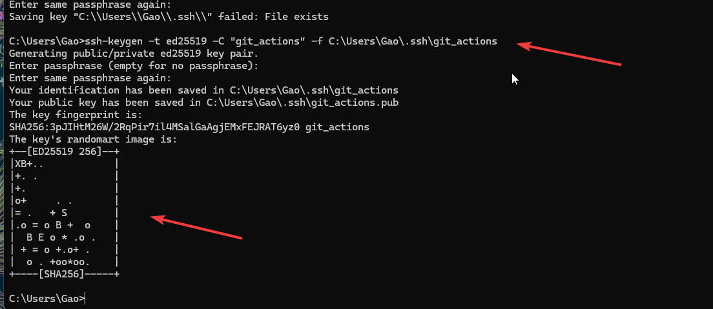


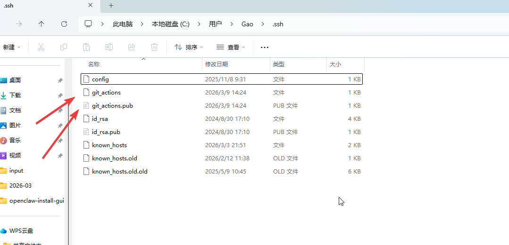

打开博客的git仓库，找到如下配置页面。然后，把 `git_actions` 文件里面的内容，完整地粘贴进来。点击 add secret 保存。如下图所示。

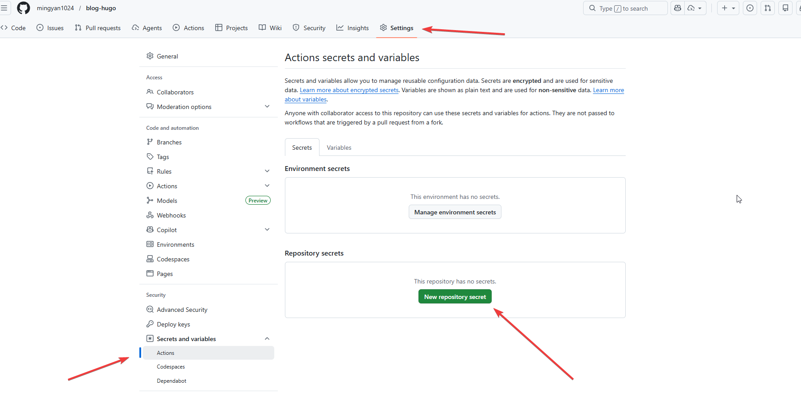

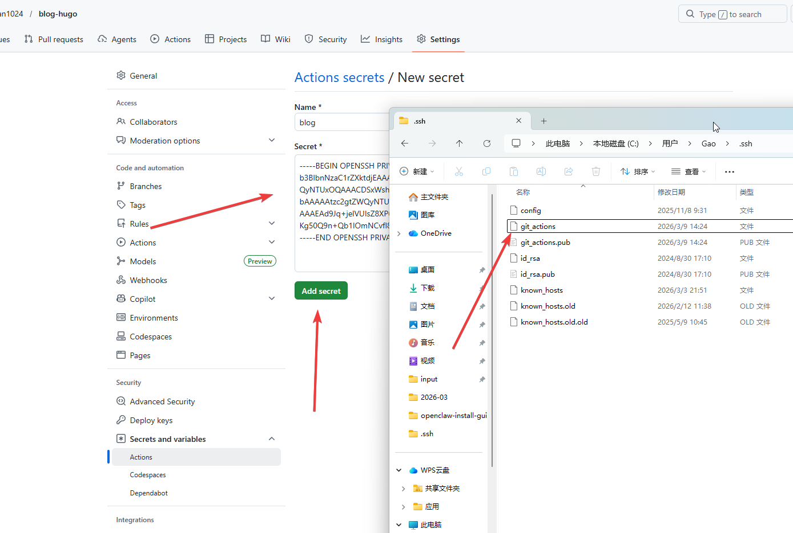

然后，用同样的方式把服务器的用户名和ip都填上。

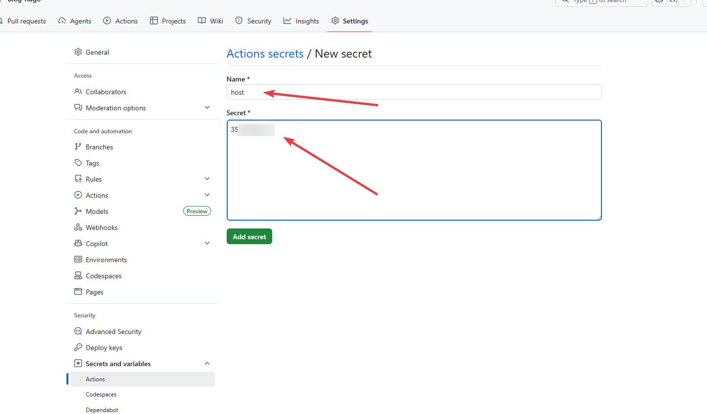

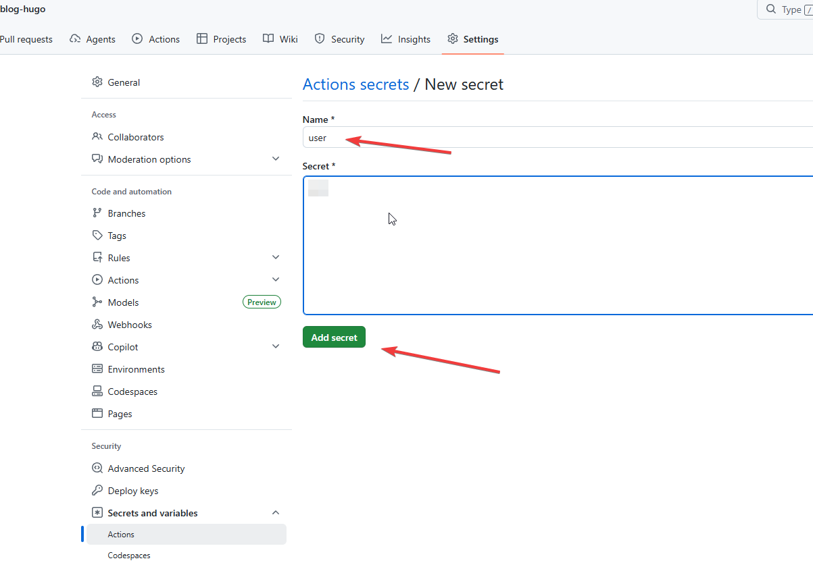

git平台会把这些填好的变量名称全部统一为大写，记住这些大写的变量名，一会会用到。

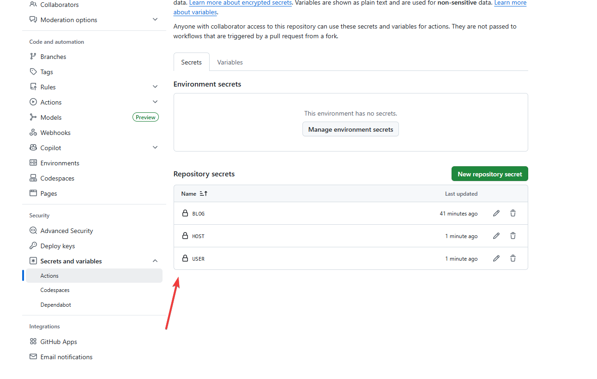

### 第二步

找到`git_actions.pub`文件，把里面的内容（也就是公钥）copy出来。

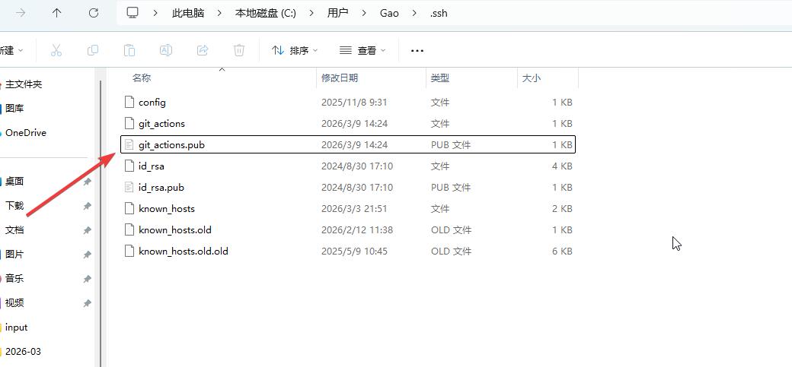


登录到服务器上，在 `root` 用户的 `~/.ssh` 目录下，输入 `echo "你复制的公钥内容" >> ~/.ssh/authorized_keys`

最后，配置一下权限，输入`chmod 700 ~/.ssh` 和 `chmod 600 ~/.ssh/authorized_keys` 指令。

## 2.2 创建deploy工作流

在本地的项目目录下，创建一个`.github/workflows/deploy.yml`这样一个文件。

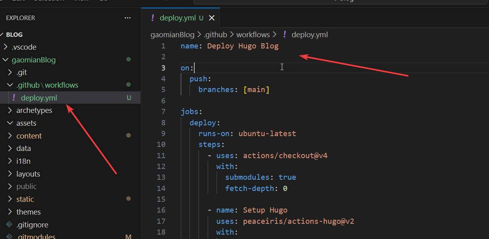


然后，填写内容如下：

```
#cicd任务名称
name: Deploy Hugo Blog

#仓库对应的推送分支
on:
  push:
    branches: [main]

jobs:
  deploy:
  # 操作系统
    runs-on: ubuntu-latest
    steps:

    #运行插件拉取代码
      - uses: actions/checkout@v4
        with:
          submodules: true
          fetch-depth: 0

    #运行插件下载hugo
      - name: Setup Hugo
        uses: peaceiris/actions-hugo@v2
        with:
          hugo-version: '0.157.0'
          extended: true
    
    #执行命令
      - name: Build
        run: hugo --minify

    #运行插件部署到服务器
      - name: Deploy to Server
        uses: burnett01/rsync-deployments@6.0.0
        with:
          switches: -avzr --delete
          path: public/
          remote_path: /opt/1panel/www/sites/gaomian.org/index/
          
          # 下面这些变量就是刚才在git上添加的服务器信息

          remote_host: ${{ secrets.HOST }}
          remote_user: ${{ secrets.USER }}
          remote_key: ${{ secrets.BLOG }}
```

deploy.yml 本质上是一个工作脚本，目的是告诉git：你需要做哪些操作，操作用到的参数是什么。

GitHub Actions 会按照你写的这个“剧本”，依次执行命令。

## 2.3 跑流水线

将项目中所有新增的变更 push 到 git 仓库中。

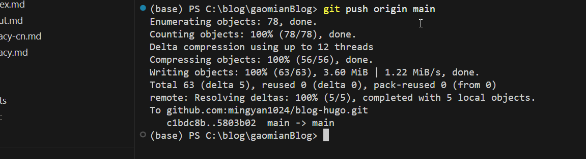

稍等一会，你会在 git 仓库的 actions 标签下，看到已经跑好的流水线。

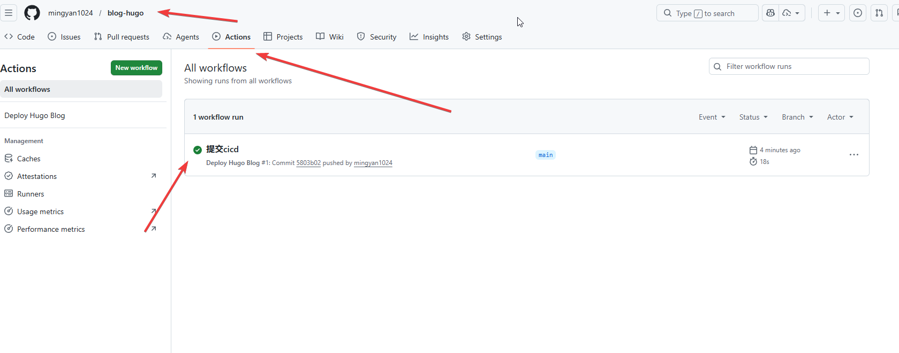

然后，打开博客，你会看到最新的内容已经显示出来了。

撒花！！完结！！

之后再发布博客内容，直接提交代码到 git 上面就可以了，无需再手动将网页文件，一个一个上传到服务器上了。


***

上文演示的，随时提交代码、随时部署的流程，便是 `ci/cd`

以上就是本期分享的全部内容。感谢阅读


