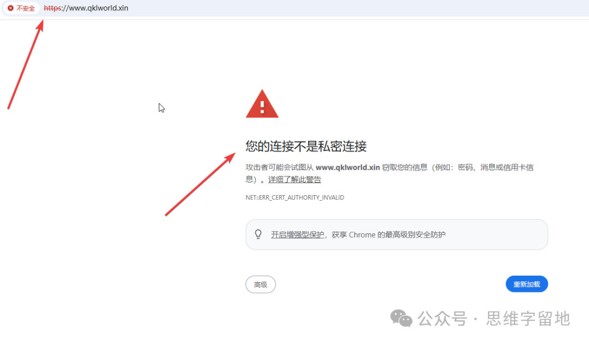

+++
date = '2026-04-02T23:17:37+08:00'
draft = false
title = 'SEO入门指南：搜索引擎优化是什么？8个提升网站排名的技巧'
tags = ['seo', '建站', '博客', '建站教程', '个人博客', '静态网站']
description = '什么是SEO（搜索引擎优化）？本文面向建站新手，介绍搜索引擎的工作原理，以及8个提升网站排名的实用技巧：HTTPS证书、sitemap提交、结构化数据、外链建设、网页响应速度、移动端适配、标题层级与URL关键词优化。'
categories = ['web建站']
+++

本文是写给想做网站、做博客的朋友。本文讨论的话题是：seo。

什么是seo呢？

它的全称是SEO（Search Engine Optimization），中文意思是：搜索引擎优化。

它的主要作用是，提高你的网站，被搜索引擎，搜出来的概率。

比方说，你做了一个分享养宠物心得的网站。

你希望其他人在搜索引擎（必应，google）上，能够快速找到你的内容。

那么做好网站的 seo ，就能达到这个目的。

可能有人认为，ai已经很厉害了，谁还会去网上搜东西呢？直接问ai不就好了。

我承认：ai确实是非常厉害，但它并非全知全能。

在我的使用体验中，我觉得它只是一个辅助工具。

也许它能解决80%的问题，但仍有一部分问题，需要自己动手收集资料解决。

以上闲扯了一些这个话题的背景，接下来进入正文。

## 1、搜索引擎的原理

搜索引擎首先会礼貌地爬取「公开」的网站信息，没错，就是用爬虫去爬。

当然了，私密的东西，肯定不会爬取。例如，你的朋友圈。

然后，解析爬下来的网站内容，存到专门用于搜索引擎的数据库，不是普通的Mysql那种数据库。

再然后，就是对这些内容进行排名。优质的、权威的内容，自然就会排在前面。

最后，用户在搜索平台输入关键字后，平台就会将相关结果，按照评级的先后顺序，给到用户。

## 2、seo技巧

能被搜索引擎，排到所有结果的头几位去展示，意味着你的网站内容相对比较出色。

进而能提高点击率，提高流量。

那么，有哪些技巧可以提高网站排名的优先次序呢？可以遵循下面这些方法：

### 2.1 配置https证书

没有https，意味着你的网站可能会有风险，别说搜索引擎了。

就连你的浏览器，都不想让你访问这个网站。

所以，请务必给自己的网站配个ssl证书。

后面，我会写文章，讲一下 `https 以及 如何给网站配置https证书`。

### 2.2 提交sitemap

这玩意，可以简单理解为 你的网站清单，相当于告诉搜索引擎：我的网站里有这些东西，你爬的时候，千万别漏掉。

其实，很多建站工具（wordpress，hexo，hugo等）都有相关的插件来生成这个文件。

因此，不需要你亲自动手写这个玩意了。

### 2.3 结构化数据

你的网站布局要清晰，例如：作者、主题、发布时间、标签等等。

你的内容越清晰、越结构化，搜索引擎越容易识别出来。

千万别整一大坨内容堆在那里，给自己挖了个大坑。

### 2.4 外链

外链，就是其它网站作者，引用你的网站的内容。

点击外链之后，浏览器会跳转到你的网站。

这其实有点像学术论文，你的论文，被别人引用的越多，意味着，你的论文越有价值。

### 2.5 网页响应速度

某些搜索引擎，会把响应速度作为重要的排名因素。

因此，压缩图片，尽可能地提高加载速度，越快越好。

### 2.6 移动端适配

现在手机的使用频率，已经远远高于电脑了。

前段时间，跟一个零零后聊天，他说，他平时都用手机。他不喜欢使用电脑，也不怎么会使用电脑，甚至连打字都不太熟练。

听完，我震惊了很久。

所以，网站一定要做好移动端适配。否则，会损失大批的手机用户。

### 2.7 标题 H1，H2 层级清晰，要有关键词

这就不用多说了，没有关键词，别人怎么会检索到你呢？

### 2.8 url中要有关键词

你的网站的url中，最好是要包含关键词。例如，

yourblog.com/python-tutorial 这个就是好的；

yourblog.com/post?id=123 这个就不太好。

---

以上就是搭建网站，提高被搜索率的一些必备的、入门级的知识。后面会写文章，讲一下实操性的内容。

感谢阅读，欢迎讨论交流。

