+++
date = '2026-03-03T10:45:33+08:00'
draft = false
title = '告别笨重的虚拟机！Windows系统使用WSL优雅运行Linux全攻略'
description = "摘要：文章分享了WSL(Windows Subsystem for Linux)的优势，手把手教你通过命令行及Microsoft Store安装linux系统的完整流程，以及应用技巧，助你打造轻量级开发环境。"
tags = ["WSL", "Linux", "Windows", "Ubuntu", "虚拟机", "教程"]
categories = ["IT工具"]
+++

wsl工具真的是太好用了！

如果你想在win系统中使用Linux，你不必再安装VirtualBox、VMWare这些虚拟机工具，直接用 wsl 就可以了。

简单汇总一下wsl的优势：

## 1、wsl优势

1、安装超级快，一键安装

2、启动也非常快，秒开

3、管理很方便，如果系统不想要了，一键删除就可以了

4、不需要繁琐的配置，除非特殊需求，基本不用改动

wsl 全称是 Windows Subsystem for Linux。看名字就可以想到，这是 windows 系统中的 linux 子系统。

简单来说，就是在你的win系统中，安装一个Linux。

该工具的底层逻辑本文就不分析了，读者可以自行查阅。本文直接讲怎么用：

## 2、wsl的安装

用管理员角色运行PowerShell，输入 `wsl --install` 。

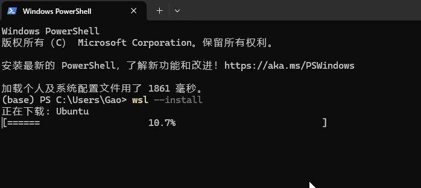

没错！就这一条指令就可以了。

安装完成之后，需要重启你的计算机。因为一些底层功能需要重启才能生效。

## 3、linux系统的安装

有了工具还不够，因为工具只是一个平台，我们还需要在平台上搭建系统。

下面分享三种安装方式：

*1、默认安装*

`wsl --install` 指令其实已经默认帮我们安装了一个Ubuntu系统。

你需要输入用户名以及密码来配置这个Ubuntu系统。

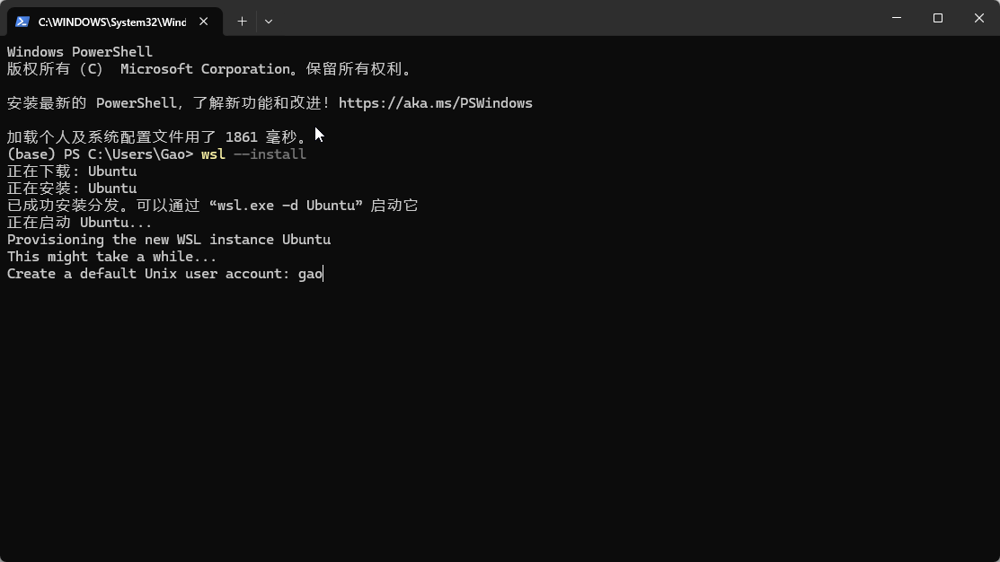

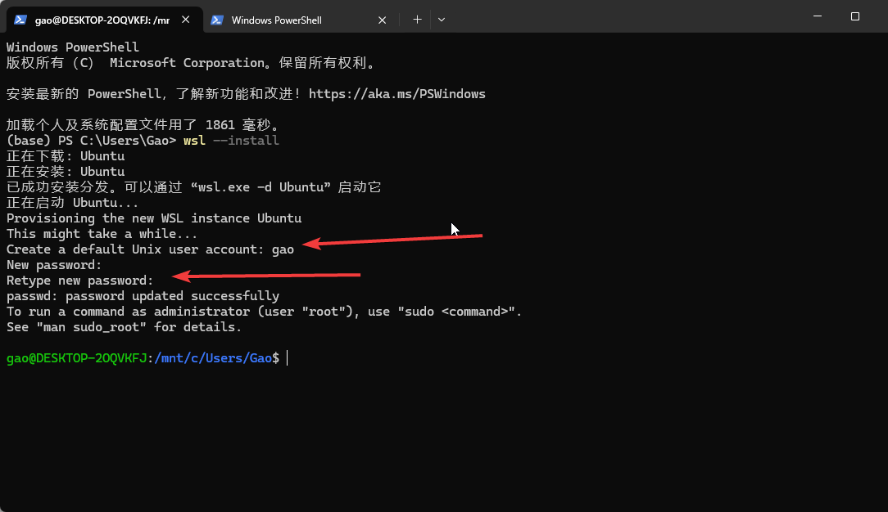

但是，因为网络问题或者其它原因，这个Ubuntu系统不一定能安装成功。

如果不成功的话，你可以参考下面两种方式。

*2、指令安装*

输入 `wsl --list --online` 指令，查看可以安装的操作系统。

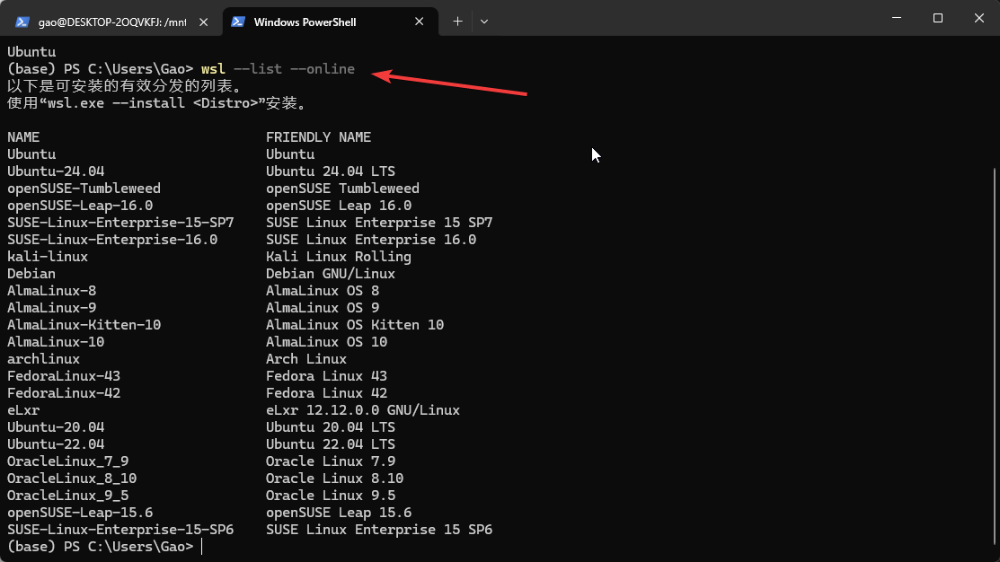

选择一个操作系统，例如 Ubuntu-22.04 进行安装。

输入 `wsl --install -d Ubuntu-22.04` 即可。

请注意：因为网络问题或者其他原因，这个方式可能依然会失败，如果失败了，你可以参考最后一种方式

*3、store安装*

打开你的 win 系统的 store 商城。

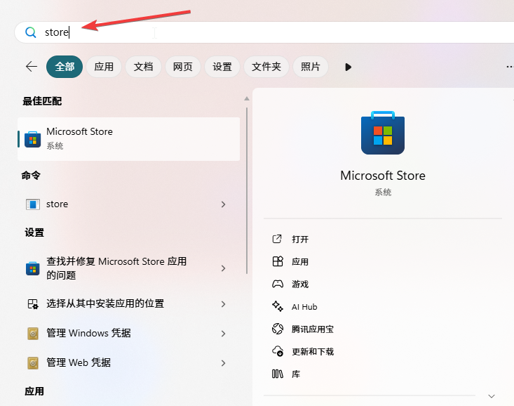

然后，搜索Ubuntu，选择其中一个开始安装。插句题外话：安装任何工具，建议安装带有 LTS 后缀的版本，因为这是官方发布的、长期维护的版本。

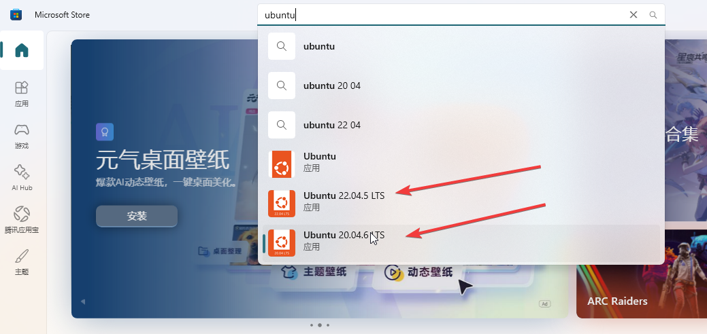

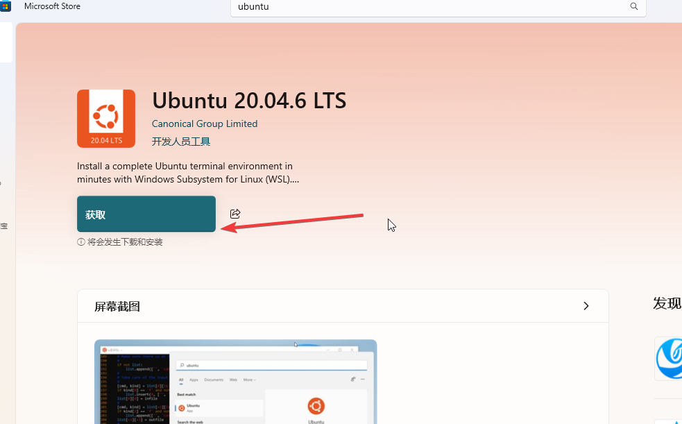

## 4、linux启动

安装 linux 系统成功之后，我们尝试启动它。启动 linux 的方式有如下两种：

*1、命令行启动*

输入 `wsl --list` 查看已安装的linux系统。

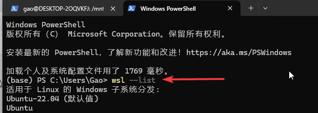

输入 `wsl -d Ubuntu-22.04` 启动指定的操作系统。

第一次进入系统的时候，会让你输入用户名和密码，跟着提示操作就可以了。

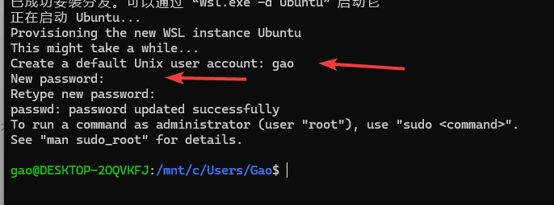

*2、图形化启动*

你可以在开始菜单找到对应的图标，鼠标点击启动。

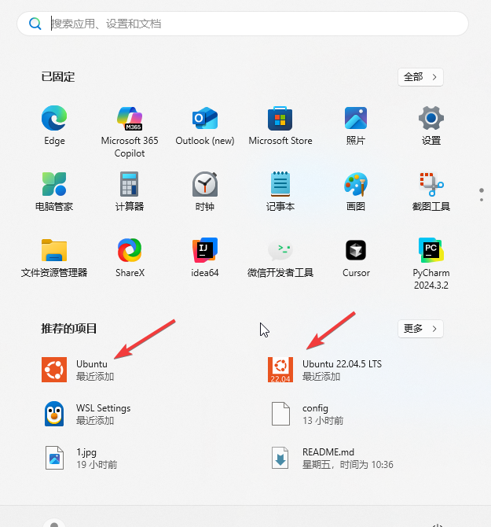

另外，如果想退出 linux 系统，回到win系统的话，就输入`exit`即可。

## 5、linux系统卸载

如果这个系统不想要了，可以通过以下两种方式删除：

*1、store卸载*

如果你的linux系统，是通过store安装的，你可以在store工具中卸载。如下所示：

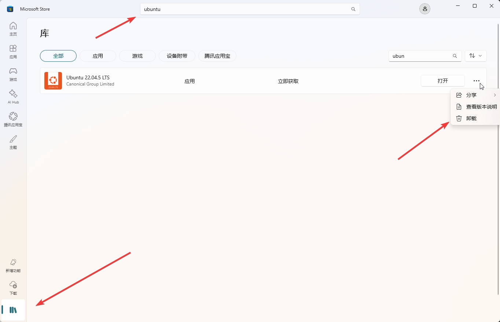

请注意，这个方式是无法将linux系统完全清理干净的，因为你本地依然保留了已经下载好的linux系统。

所以，你需要执行下面的操作。

*2、指令卸载*

命令行输入 `wsl --unregister Ubuntu-22.04`。

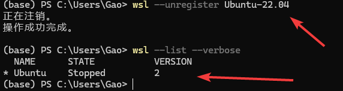

可以看到，对应的linux系统已经被清理干净了。

以上就是 wsl 工具安装、启动、卸载的基本操作，有了 wsl，再也不怕把电脑搞乱了，快来试一下吧！！

